# Confidential MLNode: self-hosted TEE inference with attested version pinning

Status: **Draft** · Glossary of attestation terms (MRTD, RTMR0–3, HOST_DATA, …): [attestation-glossary.md](./attestation-glossary.md) · Related: discussion [#951](https://github.com/gonka-ai/gonka/discussions/951), issue [#1173](https://github.com/gonka-ai/gonka/issues/1173), WIP PR [#1246](https://github.com/gonka-ai/gonka/pull/1246)

## 1. Summary

This proposal describes how Gonka hosts can run **Confidential MLNodes** on their own bare-metal hardware (Intel TDX first, AMD SEV-SNP second, NVIDIA Confidential Computing GPUs), so that:

- the user encrypts the request end-to-end to a key that provably lives inside an approved, measured MLNode image;
- the exact software version (firmware, kernel, rootfs, containers, model weights, GPU policy) is **pinned on-chain by governance** and enforced through attestation;
- no centralized key-management service (KMS), cloud operator or third-party signing infrastructure is required;
- billing and validation keep working for encrypted traffic.

The design reuses [dstack](https://github.com/Dstack-TEE/dstack) (Apache-2.0) as the guest runtime and adds a Gonka-specific verification layer: HPKE body encryption through untrusted relays, a chain-bound `report_data` layout, GPU evidence bound to the CPU quote, a machine registry, and release expiry. **The Gonka chain is the source of truth for expected measurements.**

It explicitly **does not** claim protection against a host with physical access to the machine (see [§3](#3-threat-model)). Confidential inference is positioned as a "raise the bar" option, not as an absolute guarantee. Economics (pricing, rewards, penalties) is out of scope of this draft and tracked in [§10](#10-economics-todo).

## 2. Background and current state

| Item | State (2026-09-24) |
|---|---|
| Discussion #951 / issue #1173 | Proposal for Confidential MLNodes: TEE key pair, on-chain certificate, encrypted requests, skip validation. Open questions on on-chain verification and redundancy. |
| PR #1246 `feat(WIP): experiments with dstack (TEE)` | Open since 2026-05-25, no activity since. Chain attestation messages + DAPI vote-based settlement, `intel-tdx-lite` verifier, HPKE envelope, ML-node encrypted endpoint, smoke test on a cloud TDX CVM. |
| Upstream `main` | No TEE code merged. |

### 2.1 Gaps in PR #1246 that this design addresses

| # | Gap in PR #1246 | Addressed in |
|---|---|---|
| 1 | Quote signatures are checked, but the only software identity checked is `MRTD` (firmware); kernel, rootfs and app (`RTMR1-3`) are not pinned | [§6.4](#64-verification-policy) |
| 2 | TD `DEBUG` attribute, TCB status, QE identity, CRLs not checked | [§6.4](#64-verification-policy) |
| 3 | `report_data = sha256(pubkey)` only: the same evidence can be resubmitted every epoch and inherits `VERIFIED`, and other participants can copy it | [§6.3](#63-attestation-binding-report_data) |
| 4 | `VERIFIED` status carried forward across epochs without re-validation | [§6.3](#63-attestation-binding-report_data) |
| 5 | No GPU attestation | [§6.3](#63-attestation-binding-report_data) |
| 6 | HPKE key derived via dstack KMS per `app_id` → **same private key on every node served by the same KMS root** | [§6.1](#61-confidential-mlnode-image) |
| 7 | Encrypted route bypasses devshard accounting and validation | [§6.7](#67-usage-receipts), [§6.8](#68-validation-pull-driven-by-validators) |
| 8 | vLLM error bodies returned in plaintext; `prompt_hash` sent in clear; no streaming | [§6.6.3](#663-envelope) |
| 9 | Client relies only on 65% DAPI vote, no client-side verification | [§6.6](#66-executor-selection-and-key-discovery), [§6.9](#69-gateway-trust-boundary) |

## 3. Threat model

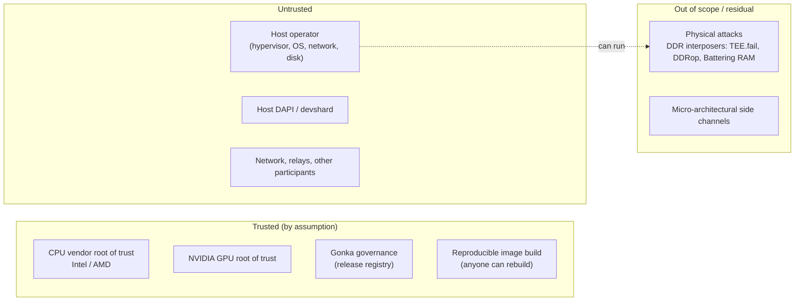

| Adversary | Goal | Protected? |
|---|---|---|
| Other participants, network observers | Read prompts, forge TEE status, replay attestations | **Yes** |
| Devshard gateway operator (escrow creator, [§6.9](#69-gateway-trust-boundary)) | Read prompts before encryption | **No** with a plain gateway; **yes** with a TEE gateway |
| Escrow creator steering slots to chosen hosts (timing creation against a known AppHash seed) | Route sessions to a colluding host | **Out of scope.** The escrow creator is an allowlisted, trusted party |
| Host via software (root on host OS, custom hypervisor, modified MLNode binary) | Read prompts, run different code/model, fake token counts | **Yes**, assuming the CPU/GPU TEE holds |
| Host via hypervisor-level ciphertext side channels (SEV-SNP, e.g. Heracles) | Leak memory contents | **Partially**: depends on firmware/TCB floor ([§7](#7-amd-sev-snp-support)) |
| Host with physical access (DDR5 interposer, ~$150–1000) | Extract attestation keys, forge quotes, read or tamper with TD memory | **No.** Vendors exclude it; no fix on current hardware |
| Compromised governance | Approve a malicious image | **No** (same trust as any chain upgrade) |

**Key consequence.** In Gonka the host *is* the party with physical custody. Beyond software-level isolation, this design relies on:
- a one-to-one machine registry;
- sampled confidential validation;
- per-node, per-boot keys that limit the blast radius of any single compromise;
- economic deterrence, which is not designed here ([§10](#10-economics-todo)).


## 4. Goals and non-goals

**Goals**
- G1. Encryption from the devshard gateway to an attested MLNode; host DAPI/devshard only see ciphertext. With a TEE gateway ([§6.9](#69-gateway-trust-boundary)), this extends to end-to-end from the user.
- G2. Governance-pinned software versions: OS image, kernel, rootfs, containers, model weights, GPU policy.
- G3. No centralized KMS and no dependency on third-party cloud, signing or key services at runtime.
- G4. Fresh attestation every epoch, bound to chain state, participant and node.
- G5. One design for Intel TDX and AMD SEV-SNP; NVIDIA CC GPU evidence bound to the CPU attestation.
- G6. Metering and sampled validation for encrypted requests.
- G7. Clients can verify attestation themselves; the on-chain status is a convenience index, not the sole trust anchor.

**Non-goals**
- Protection against physical attacks by the host.
- Confidential PoC. PoC stays as is; the Confidential MLNode also participates in PoC.
- Model-weight confidentiality (weights are public).
- Hiding traffic metadata (sizes, timing, which user talks to which node).
- Changing regular inference. MLNodes without TEE keep working exactly as today; confidential inference is an additional path.
- Any TEE mode without NVIDIA CC on the GPU: a CPU-only TEE with a regular GPU, or a scrubbing gateway (PII surrogates) in front of regular MLNodes. A model runs either fully confidential (CPU TEE + GPU CC) or as regular inference.

## 5. Architecture overview

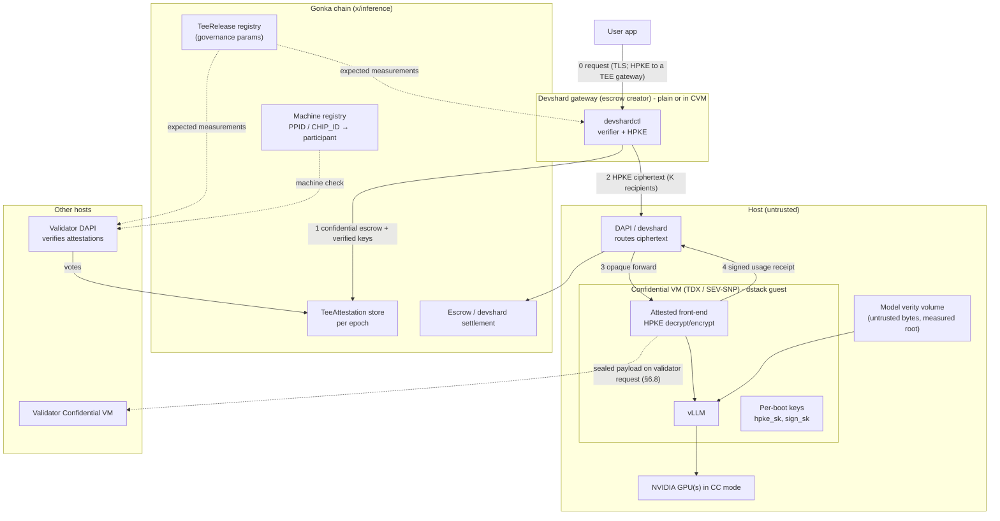

## 6. Design

### 6.1 Confidential MLNode image

Built on the dstack guest OS (≥ 0.6.0, the unified TDX/SNP image; releases pin one exact, verified image artifact, since at the time of review 0.6.0 was published only as release candidates) with the following configuration:

| Setting | Value | Reason |
|---|---|---|
| `key_provider` | `none` | Random per-boot root. No KMS, so no shared app key (PR #1246 gap 6) and no exposure to dstack issues #1287/#1288/#1293. |
| `gateway_enabled` | `false` | TLS termination is not needed; traffic is HPKE-encrypted end-to-end. |
| Containers | `image@sha256:<digest>` only | Tags are not measured. The verifier rejects a compose file that contains tags. |
| Model weights | dstack **verity volume** (`verity_volumes` in `app-compose.json`) | The host serves untrusted bytes. The guest mounts them only if they match the dm-verity root covered by `compose-hash`. Built reproducibly from `hf_repo@revision` (deterministic filesystem image, fixed verity parameters), so anyone can recompute the root. |
| GPU policy | `requirements.gpu_policy`: `attest_gpu=true`, `allow_debug=false`, `allow_devtools=false` | Hashed into `gpu-policy-hash` (TDX RTMR3 / SNP `HOST_DATA` MrConfigV3). |
| Logging | No request/response bodies in logs; vLLM request logging disabled | Enforced by the measured compose file. |
| Inbound ports | One attested front-end port | Everything else is closed inside the CVM. |

Keys are generated **inside the CVM at boot** and never leave it:

| Key | Algorithm | Purpose |
|---|---|---|
| `hpke_sk` / `hpke_pk` | X25519 | Request decryption / response encryption |
| `sign_sk` / `sign_pk` | Ed25519 | Usage receipts, validation verdicts, attestation-bound signatures |

Keys are held by a small long-lived front-end process in the CVM, separate from the MLNode API and vLLM. Restarting vLLM or switching between inference and PoC (`/inference/up`, `/inference/down`, `/pow/*`) does not touch the keys.

**Launch parameters are fixed by the release.** Today `/inference/up` accepts `model`, `dtype` and arbitrary `additional_args` from the host and passes them to vLLM (`mlnode/.../inference/manager.py` `InferenceInitRequest`, `vllm/runner.py`). Inside the CVM the measured front-end ignores those fields: the model (verity volume), dtype and every vLLM argument come from the compose file, so they are covered by `compose-hash`. `/inference/up` and `/inference/down` only start and stop the approved configuration, and PoC runs with parameters fixed by the release. Otherwise a host could change the running model or configuration while keeping the attested keys.

#### 6.1.1 Restart policy: wait for the next epoch

A CVM restart produces new keys, and the node **stays out of confidential traffic until the next epoch's attestation**. There is no mid-epoch re-attestation and no key persistence across restarts.

When the CVM actually restarts:

| Event | CVM restart | Note |
|---|---|---|
| Inference ↔ PoC switch | No | Same CVM, same keys |
| vLLM / MLNode API restart | No | Keys live in the front-end process |
| Model change | Yes | Different compose-hash (verity volume); usually at an epoch boundary anyway |
| New release | Yes | New measurements require a new attestation anyway |
| Crash, host reboot, GPU reset | Yes | The case this policy covers |

Cost on mainnet parameters: `epoch_length = 15391` blocks at about 5.3 s per block, so an epoch is about **22.7 hours**. An unplanned restart right after attestation loses up to that much confidential capacity on that node.

Why accept it:
- No extra attestation, voting or evidence storage in the middle of an epoch.
- No `PROVISIONAL` state, and so no window in which receipts are signed by keys nobody has verified yet.
- No key sealing: sealing would need a KMS or the SGX local key provider on TDX and would break "a key lives exactly as long as its CVM".
- Unplanned restarts should be rare, and planned ones (model change, release) line up with epoch boundaries.

How the impact is limited:
- **Inside a host:** the K-recipient envelope ([§6.6](#66-executor-selection-and-key-discovery)) lets the broker retry on another of the K recipients, and the gateway reselects from the participant's other attested nodes on 421 ([§6.6.3](#663-envelope)). This limits the impact to lost capacity in most cases, but it is not fully transparent: if all selected recipients are down, the request fails and is retried with a new selection.
- **Host with no live verified node:** the gateway skips that slot with a ghost nonce, as it already does for hosts in PoC or throttled, instead of letting requests time out. A request to a stale key returns 421 ([§6.6.3](#663-envelope)); the key is dropped and the gateway reselects from the participant's other attested nodes. A restarted node's new key is not eligible before the next epoch.
- **Operators who need availability** can keep a standby Confidential MLNode that is attested but idle. This is a host decision, not a protocol mechanism.

Revisit this policy if unplanned restarts turn out to be frequent in practice.

### 6.2 Release registry (on-chain version pinning)

Governance approves releases as `x/inference` params. This replaces dstack's `KmsAuth`/`AppAuth` contracts and any off-chain signing of expected measurements.

```
TeeRelease {
  release_id            string        // e.g. "cmln-2026.10.0"
  kind                  mlnode | gateway
  host_stack            HostStack
  vcpu_per_gpu, memory_per_gpu        // mlnode kind: VM size per GPU
  os_image_hash         bytes32       // sha256(sha256sum.txt) of the dstack guest image
  compose_hash          bytes32       // sha256(app-compose.json raw bytes)
  gpu_policy_hash       bytes32
  models                map[model_id] -> { hf_repo, revision, verity_root }
  not_before_epoch      uint64
  not_after_epoch       uint64        // anti-rollback: releases expire
  tdx: {
    mrtd                []bytes48     // single-pass / two-pass OVMF variants
    rtmr0_by_shape      map[shape_id] -> bytes48
    rtmr1               bytes48
    rtmr2               bytes48
    policy              TdxPolicy
  }
  snp: {
    measurement_by_shape map[shape_id] -> bytes48
    policy              SnpPolicy
  }
  nvidia_policy         NvidiaPolicy  // mlnode kind: driver / VBIOS / RIM floors, CC mode
}

VmShape {                        // mlnode kind; derived, not free-form
  shape_id                       // e.g. "h100-sxm-x8", "h200-x1", "b200-x8"
  gpu_model                      // model + form factor: h100-sxm | h100-pcie | h200 | h200-nvl | b200 | b300 | ...
  num_gpus (1|2|4|8)
  multi_gpu_mode                 // none | ppcie (Hopper x8) | mpt (Blackwell x8)
  num_nvswitches                 // from gpu_model + num_gpus
  cpu_count  = release.vcpu_per_gpu   × num_gpus
  memory_mb  = release.memory_per_gpu × num_gpus
}

GatewayShape {                   // gateway kind: CPU-only, fixed sizes
  shape_id, cpu_count, memory_mb
}

HostStack {                      // part of TeeRelease; supported baseline for reproducing
                                 // expected measurements (not itself attested, see §6.2.1)
  qemu_version, ovmf_hash, vmm_settings (pci_hole64_size, hugepages, ...), snp_vcpu_type
}
```

#### 6.2.1 Shape catalog

`RTMR0` (TDX: ACPI tables and TD HOB) depends on the VM shape: vCPUs, RAM, GPU and NVSwitch count, QEMU version, VMM settings. The SNP launch `MEASUREMENT` depends on the vCPU count and type (plus firmware, kernel, initrd and cmdline, which are per release). `RTMR0` cannot be skipped: the ACPI tables come from the host and contain AML code that the guest executes, so an unpinned `RTMR0` would let the host inject code.

Gonka does not accept arbitrary configurations. It uses **standardized shapes**:

- **A shape is determined by `(gpu_model, num_gpus)`.** vCPU and RAM follow a per-GPU formula fixed in the release. A host with a larger machine still runs the standard VM size.
- **The host stack is part of the release** (`HostStack`: QEMU version, OVMF, VMM settings) as the supported baseline from which expected measurements are reproduced. Attestation authenticates the measured guest inputs (firmware, ACPI tables, TD HOB, kernel, initrd, cmdline), not the host's QEMU binary: a modified QEMU that produces the same guest-visible inputs yields the same `RTMR0`.
- **The catalog is small.** NVIDIA CC exists only on Hopper and Blackwell data-center GPUs. Self-reported hardware of the 27 active participants at epoch 403 (about 200 hardware nodes, most of them Hopper or Blackwell; counts drift between snapshots). The table lists the main groups only and is partial:

  | Hardware | Nodes |
  |---|---|
  | 1×B300 SXM6 (AC 71, PC 13, 275GB 1) | 85 |
  | 8×H100 SXM | 35 |
  | 8×H200 | 15 |
  | 4×H100 SXM | 15 |
  | 8×B200 | 11 |
  | 2×B300 / 4×B300 | 7 / 3 |
  | 2×H200 / 6×H200 / 2×H200 NVL | 6 / 3 / 2 |
  | 4×B200 | 5 |
  | 4×/8× H100 PCIe | 2 / 2 |
  | 4×H20 | 2 |
  | 4×RTX PRO 6000 Blackwell Server | 2 (CC single-GPU only: runs as 4 × 1-GPU CVMs) |
  | 8×A100 SXM (no CC) | 5 |

  NVIDIA CC modes per GPU (NVIDIA *Deployment Guide for Confidential Computing* DU-12302-001 v7.1, April 2026; NVIDIA blog, July 2026):
  - Hopper (H100/H200): single GPU, or multi-GPU through Protected PCIe (HGX with NVSwitch);
  - B200: single GPU or multi-GPU;
  - B300: CC supported, including specific HGX B300 eight-GPU configurations (NVIDIA R595 Trusted Computing Solutions release notes; NVIDIA blog, July 2026);
  - RTX PRO 6000 Blackwell Server Edition: **single GPU per CVM only**;
  - H20: specific HGX H20 configurations are supported (for example 8×H20 in PPCIe mode, R595 release notes). Generic inventory names such as "4×H20" are not enough to approve a shape.
  - Vendor support is necessary but not sufficient: SKU, form factor, topology, firmware and driver versions, and the CPU platform must match a tested configuration before a shape enters the catalog.

  So `gpu_model` must distinguish form factors (SXM vs PCIe/NVL), because multi-GPU CC modes differ: PPCIe needs NVSwitch. GPUs without multi-GPU CC support run as several single-GPU CVMs. Non-power-of-two counts (6×H200) run as the nearest standard shape or get their own entry. The initial catalog is about 15–20 entries.

**Who computes and who approves:**

1. **Release CI** computes the expected values for every catalog shape: `dstack-mr` for TDX `MRTD`/`RTMR0`, and `sev-snp-measure` or the dstack tooling for the SNP launch measurement.
2. **Independent rebuilders** recompute them, as for the image itself.
3. **Real-hardware check:** every **new** shape is booted at least once on a real host, and the actual quote is compared with the computed value. Offline computation can diverge because of PCI topology or GPU BAR sizes under passthrough.
4. **Governance approves** the catalog **in the same proposal as the `TeeRelease`**. A shape-only `MsgUpdateParams` is possible when a shape must be added between releases.
5. **Requesting a new shape:** a host or community member opens a PR to the catalog with the shape definition. CI computes, someone validates on real hardware, and the entry goes into the next release.
6. **The catalog is built into the MLNode and gateway images**, so verifiers inside CVMs can check a peer's `RTMR0` without data from their host ([§6.4.1](#641-where-verification-runs)).

**Only `RTMR0` depends on the shape; `RTMR1` does not.** The `RTMR1` event sequence includes the Authenticode hash of the kernel as OVMF measures it:
- QEMU ≤ 10.1 rewrites the Linux setup header (initrd address and similar fields) before handing the kernel to OVMF. The initrd address depends on guest RAM, but only below 2816 MiB (`0xB0000000`, except exactly 2 GiB). Above that it is constant (`dstack-mr/src/kernel.rs`, `patch_kernel`; `acpi_data_size` is a fixed QEMU constant `0x28000`, not the size of the ACPI tables).
- QEMU ≥ 10.2 no longer rewrites the header for confidential guests (commit `a7542a38f399`), so the same image measures differently on QEMU ≤ 10.1 and ≥ 10.2.
- dstack guest OS ≥ 0.6.0 normalizes the setup header in both the shipped kernel and OVMF (`kernel_header_normalized` in `metadata.json`). The kernel event in `RTMR1` (the Authenticode SHA-384 of `bzImage`) is then the same **at every RAM size and every QEMU version** (dstack `os/image/README.md`). `RTMR1` itself is computed from the full ordered event sequence (kernel event plus the boot-service events), not as a plain file hash. Releases pin the exact image, firmware, normalization metadata and `dstack-mr` revision.
- On SEV-SNP, QEMU never rewrote the header, and the kernel hash in the launch measurement is the hash of the file.

Requirement: MLNode and gateway releases use dstack guest OS ≥ 0.6.0 with `kernel_header_normalized = true`. `RTMR1` and `RTMR2` are then per release, not per shape.

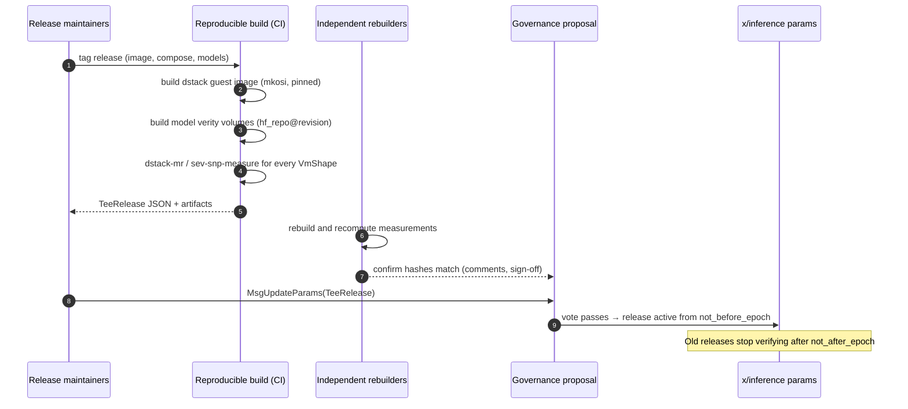

### 6.3 Attestation binding (`report_data`)

Field definitions (`REPORTDATA`, `MRTD`, `RTMR0`–`RTMR3`, SNP `MEASUREMENT` / `HOST_DATA`, NVIDIA evidence) are in the [attestation glossary](./attestation-glossary.md).

Each epoch, every Confidential MLNode produces fresh evidence. The layout is a domain-separated hash of a nonce, the key material and the device evidence, extended with chain context:

```
epoch_nonce  = block hash at PoC start height of epoch E
key_material = hpke_pk ‖ sign_pk
gpu_evidence = NVIDIA attestation reports (each GPU, + NVSwitch for Hopper PPCIe)
               requested with nonce = H(epoch_nonce ‖ participant ‖ node_id)

REPORT_DATA[0:32]  = SHA256( "gonka/cmln/report-data/v1"
                           ‖ chain_id ‖ E ‖ epoch_nonce
                           ‖ participant ‖ node_id
                           ‖ SHA256(key_material)
                           ‖ SHA256(gpu_evidence) )
REPORT_DATA[32:64] = 0
```

This closes several gaps from PR #1246:

- **Replay:** blocked by `E` and `epoch_nonce`.
- **Copying another node's evidence:** blocked by `participant` and `node_id`.
- **Carry-forward of `VERIFIED`:** removed. Every epoch requires new evidence and new votes.
- **GPU binding:** GPU evidence is bound to the CPU quote on both TDX and SNP. This matters for SNP, which has no RTMR3 and so cannot carry dstack's boot-time `gpu-attestation` event.

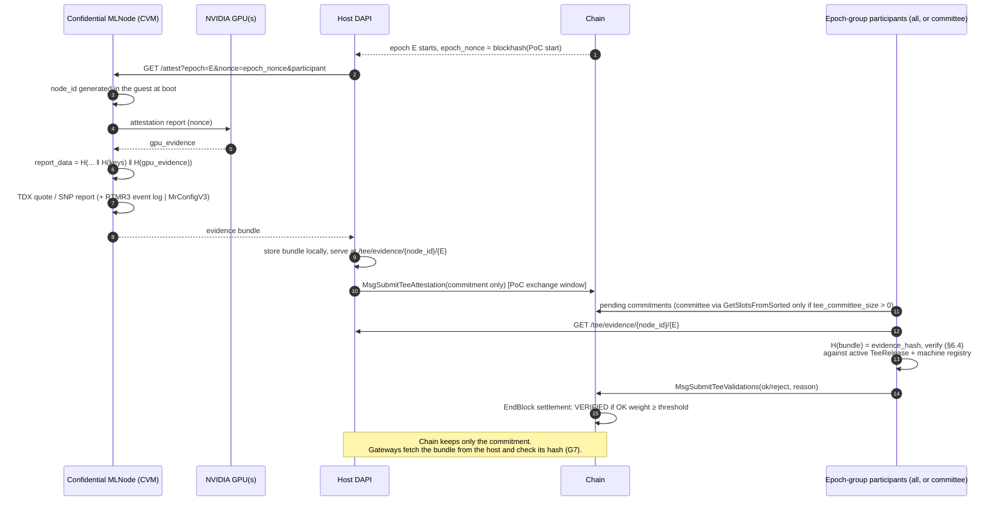

#### 6.3.1 What goes on-chain: commitment only

Chain state must not grow with evidence. The full bundle stays with the host; the chain stores a small commitment:

```
TeeAttestation {                       // ~250 bytes
  participant, node_id, epoch,
  platform, release_id, shape_id, machine_id,
  hpke_pk (32), sign_pk (32),
  evidence_hash (32),                  // SHA-256 of the canonical bundle
  status, ok_weight_bps, reject_weight_bps
}
```

- **Where the bundle lives:** the host's DAPI serves it at `/tee/evidence/{node_id}/{epoch}`. Validators and gateways fetch it and check `SHA-256(bundle) = evidence_hash` before verifying.
- **Data availability:** a bundle that cannot be fetched during the validation window counts as a reject vote. Withholding mainly hurts the host, but it can also interrupt established sessions and shrink the usable pool of a small model, so availability matters beyond the host's own interest.
- **Votes:** each attestation keeps a **voter bitmap** over the snapshot of eligible validators for its voting round (27 inference participants at epoch 403 fit in 4 bytes), plus the tallies (`ok_weight_bps`, `reject_weight_bps`). A second vote from the same validator in the same round is rejected, and each validator's weight comes from the snapshot, not from the vote. The bitmap is deleted at settlement; the vote transactions themselves stay only in block history.
- **Pruning:** records are kept for epochs `E` and `E+1`, because devshard slot hosts check receipts against the epoch-`E` attestation snapshot while co-signing sessions that run into `E+1` ([§6.7](#67-usage-receipts)), and then deleted. A record in `CHALLENGED` is kept until its challenge resolves ([§6.3.2](#632-retention-and-challenge)).
- **No carry-forward and no mid-epoch re-attestation** ([§6.1.1](#611-restart-policy-wait-for-the-next-epoch)), so **attestation records** are bounded at about 2 × (confidential nodes). Other TEE state is accounted separately: the machine registry, the revoked-key set (grows over time, since revoked keys are never re-registrable), time-limited deny-list entries, voter bitmaps (deleted at settlement), GPU allocations for the current epoch, and heartbeat nonces if the light client is adopted.

Rough size comparison per node (estimates, to be measured):

| | On-chain in the bundle design | On-chain in this design |
|---|---|---|
| CPU quote + certificate chain | ~5 KB | — |
| Intel/AMD collateral (TCB info, QE identity, CRLs) | ~10–15 KB | — (in the off-chain bundle) |
| RTMR3 event log / MrConfigV3 | ~1–3 KB | — |
| NVIDIA evidence (8 GPUs + 4 NVSwitches, with cert chains) | ~100+ KB | — |
| Commitment | — | ~250 B |

With 172 model-serving ML-node entries on mainnet (epoch 403 model groups; the self-reported hardware inventory in [§6.2.1](#621-shape-catalog) is a different, larger dataset), storing bundles would mean roughly 25 MB of transaction data per epoch if every node were confidential. Commitments take about 43 KB.

**Collateral** (Intel TCB info, QE identity, CRLs, AMD VCEK chains, NVIDIA RIMs) valid at attestation time is embedded in the bundle. The quote and device evidence are immutable; collateral is not: a challenge can bring newer collateral ([§6.3.2](#632-retention-and-challenge)). The bundle is off-chain, so this costs no chain state, and every verifier checks exactly the same collateral without depending on vendor services returning historical versions. Freshness rules are in [§6.4.2](#642-collateral-freshness).

**Security and verifiability.** Moving the bundle off-chain does not weaken verification:

- **Integrity:** the bundle is self-authenticating (CPU vendor, GPU vendor signatures) and bound by `evidence_hash` in the commitment, so the host cannot swap it or show different versions to different verifiers.
- **Same checks:** validators and gateways run the same §6.4 verification on the same bytes as with on-chain storage.
- **Availability:** depends on the host. Withholding mostly hurts the host (validators vote reject and gateways skip it), but it can also interrupt sessions and reduce a small model's pool.

What changes, and how it is covered:

| Property | Bundle on-chain | Commitment only | Mitigation |
|---|---|---|---|
| Anyone can re-verify during the epoch | from any chain node | from the host endpoint | Validators that verified the bundle keep and re-serve their copies, verifiable by hash ([§6.3.2](#632-retention-and-challenge)) |
| Re-verification after pruning (forensics, e.g. a later TCB revocation or a discovered quote forgery) | from archive nodes (transaction data) | only if someone kept a copy | Host and verifying validators keep bundles for 3 epochs; any copy is provably authentic via the on-chain hash |
| Disputing a wrong OK vote | evidence already on-chain | challenge triggers a re-vote by all epoch-group participants | Challenge with re-vote ([§6.3.2](#632-retention-and-challenge)); evidence never enters the chain |
| Validator bandwidth | chain sync | direct fetch from the host (~100+ KB per node per validator) | ~142 MB per epoch for the largest host at 27 epoch-group participants; a committee is a scaling option ([§6.3.2](#632-retention-and-challenge)) |

**Evidence bundle** (served by the host, not stored on-chain):

| Field | TDX | SNP |
|---|---|---|
| `platform` | `intel-tdx` | `amd-sev-snp` |
| CPU evidence | DCAP quote v4 + collateral (TCB info, QE identity, CRLs) | Extended attestation report + VCEK/ASK/ARK chain |
| App identity | RTMR3 event log | MrConfigV3 document (bound via `HOST_DATA`) |
| `shape_id` | ✓ | ✓ |
| `release_id` | ✓ | ✓ |
| `key_material` | `hpke_pk`, `sign_pk` | same |
| `gpu_evidence` | NVIDIA reports + certificate chains | same |
| Collateral | TCB info, QE identity, CRLs | VCEK/ASK/ARK chain |

Embedding the collateral makes verification **offline and deterministic**: validators and gateways need no live access to Intel PCS, AMD KDS or NVIDIA services.

#### 6.3.2 Retention and challenge

Both parts reuse existing Gonka patterns: PoC v2 (on-chain root, host-served data, weighted votes with an optional sampled committee, vote threshold), off-chain payloads (host retention, signed fetch endpoint) and the devshard challenge flow (`Challenged` → re-vote).

**All epoch-group participants, with a committee as a scaling option.** "Validators" in this section means the members of the current inference epoch group, voting by PoC weight; they are not the same set as consensus validators (24 at the same height), and their weights differ. On mainnet PoC v2 currently runs with `validation_slots = 0`: every participant checks every participant. At epoch 403 there are 27 active participants, so the largest host (45 nodes) would serve about 27 × 45 × 120 KB ≈ 142 MB per epoch. That is acceptable, so attestations follow the same rule: `tee_committee_size = 0` means all epoch-group participants verify and vote by PoC weight. When the network grows, a committee of `tee_committee_size` validators is chosen with `GetSlotsFromSorted` (weighted, AppHash-seeded, as for PoC v2 slots and devshard escrows).

Why all validators rather than a sampled committee at the current scale:

| | Committee of n seats (sampled by weight) | All validators (by weight) |
|---|---|---|
| Traffic for the largest host (45 nodes × 120 KB) | n = 10: ~53 MB; n = 50: ~264 MB per epoch | 27 participants: ~142 MB per epoch |
| P(top two, 48.2%, reach 65%) | n = 10: 14%; n = 27: 4%; n = 50: 0.8% | 0 |
| P(top three, 57.6%, reach 65%) | n = 10: 32%; n = 27: 23%; n = 50: 14.5% | 0 (a coalition needs the top four, 66.6%) |

Sampling only adds capture risk, and at 27 participants the traffic is small. Switching to a committee is a governance decision for when the network grows to hundreds of participants, with `tee_committee_size ≥ 50`.

**Retention: host plus validators.**

| Holder | What | How long | How served |
|---|---|---|---|
| Host DAPI | Its own bundles | `tee_evidence_retention_epochs` (default 3: the current epoch and the two preceding ones), longer while the record is `CHALLENGED` | `/tee/evidence/{node_id}/{epoch}`, signed request and response, same auth as `/v1/inference/payloads` |
| Each validator that verified a bundle | Bundles it verified | Same 3 epochs, longer while the record is `CHALLENGED` | Same endpoint shape, keyed by `evidence_hash` |

Three epochs cover settlement (`E`, `E+1`) and the challenge window with one epoch to spare. Any copy from any holder is checked against `evidence_hash`, so it does not matter who serves it.

**Voting.** Validators fetch, verify ([§6.4](#64-verification-policy)) and vote. Following PoC v2:
- a network failure is retried with backoff and then becomes a reject vote;
- a hash mismatch or a failed check is an immediate reject vote;
- a local failure is an abstention;
- `VERIFIED` requires OK weight ≥ `validation_threshold_bps` of the voting snapshot (all epoch-group participants, or the committee if `tee_committee_size > 0`).

**Challenge with re-vote.** Following the devshard `Challenged` flow:
- Any active participant can send `MsgChallengeTeeAttestation{participant, node_id, epoch, reason, collateral_hash}` for a `VERIFIED` record during epochs `E` and `E+1`. The chain records the challenge height `H_c`.
- `collateral_hash` commits to a **collateral set** (vendor-signed TCB Info, QE Identity, CRLs, VCEK chain, NVIDIA OCSP/RIM) that the challenger serves off-chain, the same way hosts serve bundles. The challenger has an incentive to serve it; if it cannot be fetched, the challenge fails.
- The record moves to `CHALLENGED`. **All epoch-group participants**, also when attestations are checked by a committee, fetch the immutable quote and evidence from any bundle holder, and verify them at time `t = time(H_c)`.
- **Collateral selection rule:** for each collateral type, use the newest valid item with `issueDate ≤ time(H_c)` among the bundle's original collateral and the challenger's set. All validators apply the same rule to the same inputs, so they reach the same result. This is how a revocation or TCB recovery published after the first vote is detected.
- Challenge does not protect against a colluding majority, and neither does the chain's own consensus.
- **Upheld:** the record becomes `REVOKED`, and the revocation propagates:
  - `hpke_pk` and `sign_pk` go into a revoked-key set; every record with the same key in epochs `E` and `E+1` becomes `REVOKED`, and the key can never be registered again;
  - the `machine_id` goes into `denied_machine_ids` for `tee_machine_denial_epochs`; records of that machine in `E` and `E+1` become `REVOKED`;
  - if the reason is a TCB or collateral revocation, a new attestation from that machine must carry collateral at least as new as the collateral that upheld the challenge.

  Gateways stop using the key, and requests to it get 421. Consequences for the host are in [§10](#10-economics-todo).
- **Rejected:** the record returns to `VERIFIED`.
- Each participant has a per-epoch challenge limit, following the invalidation-limits design.
- **Completion rules:**
  - at most **one open challenge per record**; further challenges against the same record are rejected until it resolves;
  - the re-vote has a deadline of `tee_challenge_vote_blocks`. If the upheld threshold is not reached by then (no quorum, or the challenger's collateral set cannot be fetched), the challenge fails and the record returns to `VERIFIED`;
  - a record in `CHALLENGED` is not pruned until its challenge resolves, even past `E+1`; its revocations still apply if upheld;
  - a challenge submitted late in `E+1` keeps the record (and its bundle) until the challenge resolves.

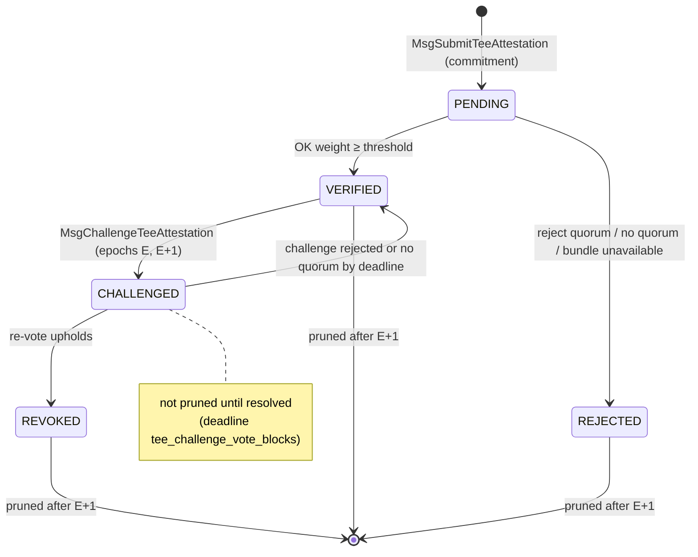

What challenge covers, and what it does not:
- **Covers:** careless or dishonest votes; collateral revoked after the vote (for example an Intel or AMD TCB recovery or a PCK revocation after a platform compromise); mismatches between the bundle and the commitment.
- **Does not cover:** a quote forged with attestation keys extracted by a physical attack. Such a quote is cryptographically valid. This remains the residual risk from [§3](#3-threat-model).

### 6.4 Verification policy

A shared Go verifier (in DAPI and the client SDK) runs two platform providers behind one interface. The starting points are `google/go-tdx-guest` and `google/go-sev-guest`.

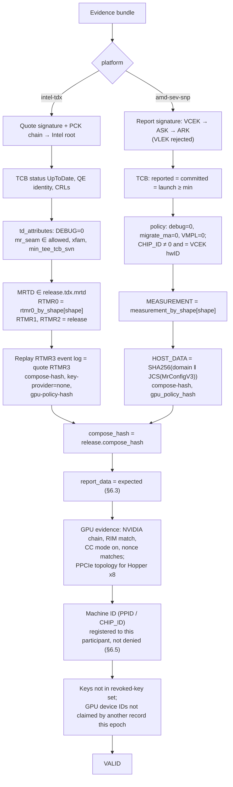

Checks, per platform:

| Check | TDX | SNP |
|---|---|---|
| Signature chain | PCK → Intel SGX root (pinned) | VCEK → ASK → ARK (pinned, per product family: Milan/Genoa/Turin) |
| TCB | `UpToDate` required; `min_tcb_evaluation_data_number` ([§6.4.2](#642-collateral-freshness)) | Reported = committed = launch; each component ≥ floor |
| Debug | `TD_ATTRIBUTES.DEBUG = 0` | `POLICY.DEBUG = 0` |
| Platform module | `MR_SEAM` allowlist | — |
| Firmware | `MRTD` | Part of `MEASUREMENT` |
| Kernel / initrd / cmdline (rootfs verity) | `RTMR1`, `RTMR2` | Part of `MEASUREMENT` |
| VM shape | `RTMR0` | Part of `MEASUREMENT` (vCPU count/type) |
| App / compose / GPU policy | RTMR3 replay | `HOST_DATA` → MrConfigV3 |
| Machine identity | PPID (from PCK cert) | `CHIP_ID`: reject all-zero (platform set MaskChipId), and require it to match the hardware ID in the verified VCEK certificate |

#### 6.4.1 Where verification runs

There is no on-chain quote verification. The same Go verifier runs in several places, and each place makes its own decision:

| Verifier | Runs in | Decides | Expected values from |
|---|---|---|---|
| Attestation vote (epoch-group participants) | Validator DAPI (worker, like PoC v2 validation) | Chain status `VERIFIED` / `REJECTED` | Validator's own chain node |
| Challenge re-vote (epoch-group participants) | Validator DAPI | `REVOKED` or not | Validator's own chain node |
| Plain gateway (`devshardctl`) | Gateway process, **before encrypting** | Which MLNode keys receive plaintext | Operator's own chain node |
| User SDK (TEE gateway) | User's machine | Whether to trust the gateway CVM | Any chain node the user trusts |
| TEE gateway | **Inside the gateway CVM** | Which MLNode keys receive plaintext | **Pinned in the gateway image** (see below) |
| Executor CVM (confidential validation) | **Inside the executor CVM** | Whether to send plaintext to a validator CVM | **Its own measurements** (see below) |
| Host pre-flight (optional) | Host DAPI before `MsgSubmitTeeAttestation` | Avoid submitting a bundle that will be rejected | Host's chain node |

The votes decide the **chain status**. Confidentiality is decided by whoever is about to send plaintext (gateway, SDK, executor CVM), and they verify for themselves instead of relying on the chain status.

**Why the chain does not verify quotes itself.** The chain only runs structural checks on the commitment: active release, valid shape, `machine_id` registered to the participant and not denied, keys not in the revoked-key set, GPU device IDs not already claimed in the epoch, key format, epoch.
- User confidentiality never depends on the chain status.
- At the current scale all members of the epoch group vote by PoC weight (`tee_committee_size = 0`). Weight is concentrated (epoch 403: 27 participants, top shares 25.7%, 22.5%, 9.4%). The assumption is that the same operators also dominate consensus, so on-chain verification would not remove that trust.
- Challenge covers wrong votes ([§6.3.2](#632-retention-and-challenge)).
- On-chain verification would put TDX/SNP/NVIDIA parsing and x509 into consensus code, and every verifier update would become a chain upgrade.

The verifier is written to be deterministic (pure Go, pinned library versions, time passed in as input), so it can move on-chain for dispute resolution later without a rewrite. Revisit if an external consumer (another chain, a contract) needs attestation status without trusting votes, if TEE nodes are ever exempted from validation, if weight concentrates enough to capture votes, or if challenges do not resolve disputes reliably.

**Verifiers inside a CVM cannot take expected values from the host.** Everything a CVM receives from outside comes through its host. Evidence is self-authenticating, but the list of allowed measurements is not: a host could feed a fake release and point the CVM at a "validator" or "MLNode" it controls outside any TEE. Rule used: **same approved configuration**.

- **Executor CVM → validator CVM.** Whole `RTMR3` or `HOST_DATA` values cannot be compared between nodes: they include per-instance inputs (`instance-id`, the `gpu-attestation` event with its evidence hash, `instance_id` in MrConfigV3). The executor instead:
  1. on TDX, replays the peer's RTMR3 event log and checks it against the peer's own quote; on SNP, checks `HOST_DATA = SHA256("dstack-mr-config-v3:" ‖ 0x00 ‖ JCS(MrConfigV3 document))` of the peer's report (the same construction as in the [glossary](./attestation-glossary.md#5-dstack));
  2. compares only the **release-defining fields** with its own: `MRTD`, `RTMR1`, `RTMR2`, `compose-hash`, `gpu-policy-hash`, `key-provider = none`, and checks `RTMR0` against the shape catalog built into the image for the peer's shape ([§6.2.1](#621-shape-catalog)). On SNP, the peer's launch measurement is checked against `measurement_by_shape[peer.shape_id]` from the same built-in catalog, since it depends on the shape. The OS image is authenticated by these recomputed launch and boot measurements, not by the `os-image-hash` runtime event, which dstack emits only on the KMS path;
  3. ignores per-instance fields (`instance-id`, GPU evidence hash), which are checked separately against the peer's own evidence.

  The executor reads its own values from its own quote, so nothing comes from the host. Cross-platform peers (TDX ↔ SNP) and the previous/next release during an upgrade are covered by a small table of sibling values **built into the image**, which is itself measured.
- **TEE gateway → MLNodes:** the gateway is a different image, so the same-approved-configuration rule does not apply literally. The gateway release is built together with the MLNode releases it serves ("paired releases"), and their expected measurements are built into the gateway image. A new MLNode release therefore needs a new gateway release.

**Known gap:** built-in values cannot tell a CVM that a peer's machine or release was revoked after the image was built, or which epoch it is. The proposed fix is a light client inside CVMs ([§6.10](#610-under-discussion-light-client-inside-cvms)).

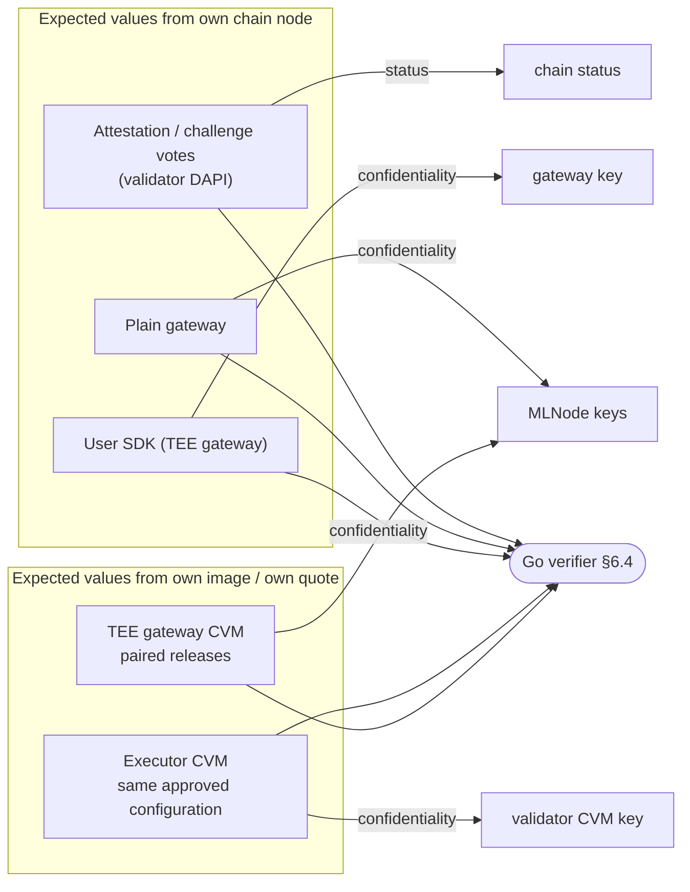

#### 6.4.2 Collateral freshness

The host supplies the collateral in its bundle. Verifiers check it against params only, with no oracle and no live fetching:

| Check | Intel TDX | AMD SEV-SNP | NVIDIA |
|---|---|---|---|
| Vendor signature | TCB Info, QE Identity, CRLs signed by Intel | VCEK/ASK/ARK chain, CRL signed by AMD | Certificate chains, RIMs, OCSP responses |
| Within vendor validity | `issueDate ≤ t ≤ nextUpdate` | CRL `thisUpdate ≤ t ≤ nextUpdate` | OCSP / RIM validity |
| Not older than the network allows | `issueDate ≥ t − max_collateral_age` | same for CRL | same for OCSP |
| Version floor | `tcbEvaluationDataNumber ≥ min_tcb_evaluation_data_number` | TCB component SVNs ≥ floors in `SnpPolicy` | driver / VBIOS / RIM versions ≥ floors |
| Revocation floor | PCK CRL number ≥ `min_pck_crl_number` | CRL number ≥ `min_amd_crl_number` | — |
| Not revoked | PCK not in CRL | VCEK/ASK not in CRL | OCSP status good |

`t` is the **block time of the epoch's PoC start** (for a challenge, `t = time(H_c)`, [§6.3.2](#632-retention-and-challenge)), not the verifier's clock, so every verifier gets the same result for the same bundle.

**What an old but still valid collateral affects.** A host may pick the oldest collateral that still passes these checks. This does **not** affect:
- quote signatures;
- measurement pinning (MRTD/RTMR, launch measurement, `compose_hash`);
- the `report_data` binding to keys, epoch and participant.

It **only** affects how fast the network reacts to new vendor events:

| Vendor event | Effect of stale collateral | Closed by |
|---|---|---|
| TCB recovery (new microcode or firmware fixes a TEE vulnerability) | A host that has not patched still shows `UpToDate` | Governance raises `min_tcb_evaluation_data_number` / SNP floors, with an enforcement epoch announced in advance |
| Revocation of a platform key (for example, a PCK leaked through a physical attack) | A revoked platform still passes until its old CRL expires | Governance raises `min_pck_crl_number` / `min_amd_crl_number`, or adds the `machine_id` to a deny-list |
| Collateral older than the network accepts | — | `max_collateral_age` (suggested 7 days) bounds collateral age at admission even without a governance action; exposure is up to that plus one epoch (see below) |

Nothing breaks. `max_collateral_age` is an **admission** bound, checked at PoC start: an attestation admitted with collateral up to `max_collateral_age` old then stays usable for the rest of the epoch (about 22.7 hours), so the exposure to a known-weak platform is up to `max_collateral_age` plus one epoch, or until a governance update or challenge revokes it. This bound does not apply to verifiers inside CVMs. A host that stops refreshing its collateral only hurts itself, because its bundle falls outside the window and is rejected.

**Inside CVMs** (executor → validator, TEE gateway), the clock and the network belong to the host, so time windows cannot be trusted. There, only the floors built into the image apply (`tcbEvaluationDataNumber`, SNP SVNs, CRL number), together with the same-approved-configuration rule ([§6.4.1](#641-where-verification-runs)). A new release raises these floors. **This does not bound staleness:** a host can present old collateral for a peer revoked after the image was built. The `max_collateral_age` bound does not apply on this path; see [§6.10](#610-under-discussion-light-client-inside-cvms).

### 6.5 Machine registry

```
MsgRegisterTeeMachine { participant, platform, machine_id (PPID | CHIP_ID), evidence }
```

- A `machine_id` can be bound to **at most one participant**. Re-binding requires the previous owner to unregister, or waits out `tee_machine_rebind_cooldown_epochs`.
- An attestation is valid only if the quote's machine ID is registered to the submitting participant.
- This stops a single honest machine from being "lent" to many participants, and stops quotes from being shared between them.
- It gives governance a handle for later action, such as deny-listing a machine ID that turns up in a forged-evidence incident.
- It does **not** prove the absence of an interposer. In Gonka it means "machines registered to this participant", not "machines in trusted custody".

**GPU allocation per epoch.** The machine registry binds CPUs, not GPUs. Without a GPU rule a host could obtain several valid attestations for the same GPUs (each correctly bound to a different `node_id`) and count their capacity more than once ([§6.6.4](#664-confidential-escrow)). Therefore:
- every attestation lists the device identities of its GPUs (and NVSwitches), taken from the verified NVIDIA device certificates in its evidence;
- for each epoch the chain keeps `gpu_device_id → attestation`; an attestation that claims a device already claimed by another record in the same epoch is rejected;
- one CPU machine may host several attestations only with **disjoint** GPU sets;
- `node_id` is generated inside the approved guest and bound in `report_data`, not chosen by the host.

### 6.6 Executor selection and key discovery

#### 6.6.1 What devshard already fixes

Classic inference is deprecated (`/v1/chat/completions` returns 410). All traffic goes through devshard:

- `MsgCreateDevshardEscrow` samples `group_size` slots by validation weight, with replacement, seeded from the AppHash (`calculations/slots.go`).
- The executor of every request is deterministic: `group[nonce % len(group)]` (`devshard/state/machine.go`).
- The gateway (`devshardctl`) learns every slot's host and URL at escrow creation and sends each request directly to that host.
- Inside the host, the DAPI broker picks the ML node **after** the request arrives (`Broker.getLeastBusyNode`, least `LockCount`, retry on another node on failure).

So the **host** is known before the body is sent; the **ML node** is not. The per-node HPKE key conflicts with the broker's load balancing and failover.

Mainnet snapshot (epoch 403, chain v0.2.15, `group_size = 16`):

| Model | Participants | ML nodes | Nodes per participant (median / p90 / max) | Top-3 weight share |
|---|---|---|---|---|
| MiniMax-M2.7 | 23 | 143 | 2 / 9 / 45 | 28.7%, 24.0%, 10.0% |
| DeepSeek-V4-Flash | 8 | 25 | 1 / 14 / 14 | 56.7%, 16.0%, 7.6% |
| GLM-5.3-Flash | 4 | 4 | 1 / 1 / 1 | 31.9%, 28.8%, 20.4% |

#### 6.6.2 Multi-recipient encryption

The host stays bound to the escrow slot, as today. The body is encrypted once, and the key that opens it is wrapped for **K randomly chosen `VERIFIED` Confidential MLNodes of the slot's participant** for that model.

- K is a governance param (`confidential_recipients_k`), **default 3**. If the host has fewer verified nodes, all of them are used. On mainnet (epoch 403) a participant has a median of 1–2 nodes per model, so K = 3 usually means all of them. For large hosts (up to 45 nodes), the broker picks the least busy of 3 random nodes, and a new random set is drawn for every request. That already balances load close to optimally ("power of d choices"), so a larger K adds little except more machines able to decrypt.
- All K nodes belong to the same participant, so letting K nodes decrypt adds no new party to the trust set. Capping K limits how many machines a single physical compromise can reach and keeps the header small (a host with 45 nodes would otherwise need about 4 KB per request).
- The broker routes to the least-busy node whose key ID is in the recipient list. If that node fails, it retries on another listed node.

#### 6.6.3 Envelope

```
secret        = random(32)
for each recipient i in K:
    enc_i, ctx_i = HPKE.SetupBaseS(pk_i, info="gonka/cmln/wrap/v1")   // enc_i does not depend on AAD

protected     = canonical{ version, escrow_id, session_nonce,
                           recipients: [(key_id_i = SHA256(pk_i)[:8], enc_i)] }   // sorted by key_id
for each recipient i:
    ct_i      = ctx_i.Seal(aad = SHA256(protected), pt = secret)

key, nonce    = HKDF(secret, "gonka/cmln/request")
body_ct       = AEAD-chunked(key, nonce, body, aad = SHA256(protected ‖ ct_1 ‖ … ‖ ct_K))
resp_key      = HKDF(secret ‖ response_nonce, "gonka/cmln/response")

header (clear) = protected + [ct_1 … ct_K]
```

- Suite: HPKE base mode ([RFC 9180](https://www.rfc-editor.org/rfc/rfc9180)), DHKEM(X25519, HKDF-SHA256), HKDF-SHA256, AES-256-GCM.
- There is no circular dependency: the wrapped secrets `ct_i` are bound to the protected header (all recipient key IDs and encapsulations), and the body is bound to the protected header plus every `ct_i`. A recipient cannot be added, removed or swapped without breaking decryption.
- Size per recipient: about 88 bytes (8-byte key ID, 32-byte `enc`, 48-byte wrapped secret).
- The response uses [OHTTP](https://www.rfc-editor.org/rfc/rfc9458)-style encapsulation: a random `response_nonce` in clear and a key derived from `secret`. It is chunked, so SSE streaming works.
- The node that served the request returns its `key_id` in the response header, so the gateway knows which `sign_pk` to check the receipt against.

Gonka-specific rules:

| Rule | Reason |
|---|---|
| `session_nonce` (devshard nonce) is in the protected header. Each CVM keeps, per escrow, the set of nonces it has executed within a sliding window (`cmln_nonce_window`, default 4096) and rejects a nonce it has already executed, a nonce below the window, or a nonce above the escrow's `max_nonce`. Requests may arrive and run in any order, as devshard dispatches them concurrently. Devshard accepts **one receipt per nonce**. Retrying on another of the K recipients is allowed only after the first one failed; the receipt from the node that completed the request is the one devshard counts | Body encryption alone has no request-replay protection. A host can still replay one envelope on two different recipient nodes. That only burns its own GPU time: both outputs are encrypted and only one receipt is accepted. This residual is accepted |
| No plaintext error bodies. Upstream errors are encrypted or replaced by a generic code. | Fixes PR #1246 leak via vLLM error text. |
| No hash of the plaintext anywhere outside a CVM. In confidential escrows the devshard `PromptHash` field carries `H(request envelope)` (protected header, all `ct_i` and the chunked `body_ct`, exactly as received), and `ResponseHash` carries `H(resp_ct)` (the chunked encrypted response exactly as streamed). Receipts commit the same values ([§6.7](#67-usage-receipts)). | Diffs are seen by every slot host and by the gateway operator. A plaintext hash would let them confirm guesses ("is the prompt X?"). |
| Random-length padding field in SSE chunks | Reduces token-length leakage. |
| Unknown recipient key IDs return 421 (key mismatch) | Handled per key: the gateway marks that key unusable for the epoch and re-encrypts to K keys chosen from the participant's **remaining** attested nodes. The participant is treated as unavailable for the slot only when it has no attested node left for the model, and the slot is then skipped with a ghost nonce. A restarted node's new key is not eligible before the next epoch ([§6.1.1](#611-restart-policy-wait-for-the-next-epoch)). |

#### 6.6.4 Confidential escrow

A confidential session needs its own escrow type so that its slots land on hosts that can actually serve encrypted traffic:

- **Eligibility:** only participants with at least one `VERIFIED` Confidential MLNode for the model in the current epoch.
- **Weight:** the participant's confidential weight, not its total weight. Otherwise a host with one TEE node and 100 regular nodes would receive many slots and little confidential capacity.
  - PoC weight alone does not prove which hardware did the work: `MsgMLNodeWeightDistribution` only checks that per-node weights sum to the committed count (`msg_server_poc_v2_commit.go`), so a host could attribute regular-GPU work to a verified `node_id`.
  - Each verified node's confidential weight is therefore `min(its PoC weight, attested capacity)`. Attested capacity is a governance table (`attested_capacity`, per model, GPU model and GPU count), looked up with the GPU model and count from the node's verified GPU evidence and shape. The host can still over-attribute, but not beyond what the attested GPUs could physically produce.
  - PoC already runs inside the same CVM ([§6.1](#61-confidential-mlnode-image)). A stronger binding would be to have the CVM sign PoC results with `sign_pk`, so weight is provably produced by the attested GPUs. That changes the PoC protocol and is not part of this design.
- **Slot cap per participant:** sampling with replacement concentrates slots. With `vote_threshold_factor = 50`, a participant holding 9 of 16 slots alone decides timeouts and validation votes in the session, and sees most of its traffic. Without a cap, on mainnet weights (epoch 403, binomial over 16 slots):

  | Who | Weight share | Expected slots | P(≥ 9 of 16) |
  |---|---|---|---|
  | DeepSeek-V4-Flash, top participant | 56.7% | 9.1 | 62% |
  | DeepSeek-V4-Flash, top two together | 72.7% | 11.6 | 96% |
  | MiniMax-M2.7, top participant | 28.7% | 4.6 | 2% |
  | MiniMax-M2.7, top two together | 52.7% | 8.4 | 49% |
  | GLM-5.3-Flash, top participant | 31.9% | 5.1 | 4% |

  Rules:
  - `confidential_max_slots_per_participant` **default 5** (`group_size / 3`): no single participant reaches 9.
  - `confidential_min_participants` **default 4**: a confidential escrow for a model is created only if at least 4 participants have `VERIFIED` nodes for it, the minimum needed to fill 16 slots under a cap of 5. Below that, confidential escrows for the model are unavailable instead of silently concentrated. Small models are fragile here: GLM-5.3-Flash has exactly 4 participants at epoch 403, so a single participant without verified nodes (for example after a restart) makes confidential escrows for it unavailable.
  - The cap does not stop two large participants from colluding (2 × 5 = 10). That is accepted, because escrow-level collusion is covered by the same trust assumptions as devshard today.
  - These figures use total weight. Confidential escrows use confidential weight, which is only known once TEE hosts are running, so both values are reviewed after the first epochs with real TEE hosts.
- **Key snapshot:** the escrow does not store keys. Keys are taken from the per-epoch attestation records, and they change only when a CVM restarts, not every epoch.
- **Predictability:** the AppHash seed is known one block ahead, so the creator could time escrow creation to target specific hosts. This is out of scope: escrow creators are allowlisted and trusted ([§3](#3-threat-model)).

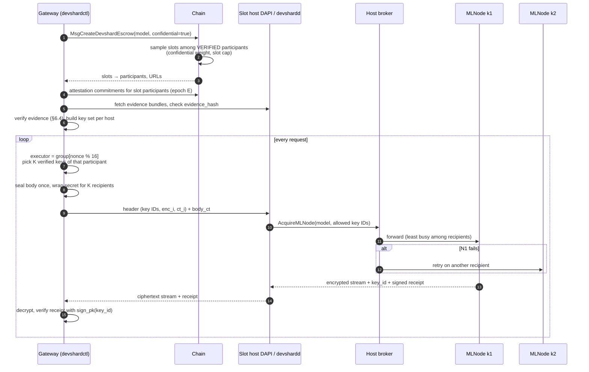

### 6.7 Usage receipts

An HMAC over a shared secret only works when a single operator trusts its own control plane. Gonka needs receipts that anyone can verify:

```
UsageReceipt {
  escrow_id, session_nonce, node_id, epoch, release_id,
  request_ct_hash,       // H(request envelope): protected header, ct_1..ct_K, chunked body_ct
  response_ct_hash,      // H(resp_ct): chunked encrypted response as streamed
  transcript_ct_hash,    // H(transcript_ct): logprobs and validation data,
                         //   encrypted with a key derived from the request secret
  prompt_tokens, completion_tokens, cached_tokens,
  finish_reason
}
signature = Ed25519(sign_sk, "gonka/cmln/receipt/v1" ‖ receipt)
```

- The receipt is returned to the gateway as an HTTP trailer and to devshard alongside the response.
- Devshard includes receipts in its state and signatures as usual.
- **Enforcement point:** chain settlement receives only per-slot aggregates, not individual receipts. Receipts are therefore checked by the **devshard slot hosts before they co-sign the session state**: each receipt must be signed by a `sign_pk` from a `VERIFIED` attestation of the executor's participant in the receipt's epoch, taken from the hosts' attestation snapshot at the diff's height. A diff with an invalid receipt is not signed, so it cannot reach settlement. Receipts signed by a key revoked later are open question 3.
- The host cannot inflate token counts without breaking the TEE: the counts come from inside the measured image.
- **Response binding.** The gateway checks `response_ct_hash` against the stream it actually received. Validation later decrypts exactly the committed `resp_ct` and `transcript_ct`, so an executor cannot deliver one output and present another for validation. No plaintext hash is exposed.
- The gateway can dispute a receipt: it holds the plaintext and can recount tokens locally. With a TEE gateway the recount happens inside the gateway CVM.

### 6.8 Validation: pull, driven by validators

Discussion #951 proposed skipping validation for TEE nodes. This proposal **keeps sampled validation**:
- a forged quote (see [§3](#3-threat-model)) must not mean that outputs go unchecked;
- validation also catches misconfigured or faulty-but-attested nodes.

Validation follows the existing devshard model, where **validators decide what to validate**. The executor does not choose the sample and does not know it in advance.

**Sealed payload.** For every completed request the executor CVM keeps, for the validation window, `{secret, request envelope (protected header, ct_1..ct_K, chunked body_ct), resp_ct, transcript_ct}`, encrypted to a per-boot storage key that never leaves the CVM. The host stores only this ciphertext.

**Flow.**
1. A validator selects an inference with its own seed (`ShouldValidate`, as in devshard today). The validator must belong to a **different participant** than the executor, not just a different slot: slots are sampled with replacement, so one participant can hold many slots of the same escrow ([§6.6.4](#664-confidential-escrow)).
2. **The obligation becomes public:** the validator adds a signed `ValidationFetchRequest{inference_id, validator_slot, validator_key_id}` to the devshard state. The deadline `validation_fetch_deadline` starts when that request is included. Before that there is no obligation; a validator that never sends a request cannot blame the executor.
3. The validator CVM sends the request and its own evidence to the executor CVM through both hosts.
4. The executor CVM verifies the validator under the same-approved-configuration rule ([§6.4.1](#641-where-verification-runs)), unseals the stored payload and seals it to the validator's `hpke_pk`.
5. **Proof of serving:** the executor adds `ValidationPayloadServed{inference_id, validator_slot, H(sealed_payload)}`, signed by its `sign_pk`, to the devshard state, and its host serves the sealed blob for the rest of the window.
6. The validator CVM checks `H(envelope) = PromptHash`, `H(resp_ct) = ResponseHash` and `transcript_ct_hash` against the devshard record and the receipt, checks `escrow_id` and `session_nonce` in the protected header, rebuilds the body AAD from the envelope, decrypts with keys derived from `secret`, re-runs, compares and signs a verdict.

**Who is at fault.**

| Situation | Outcome |
|---|---|
| Request included, no `ValidationPayloadServed` before the deadline | Failed validation for the executor |
| `ValidationPayloadServed` recorded, no verdict from the validator | Other slot hosts fetch the sealed blob from the executor host and check its hash (they cannot read it). If available, the validator is at fault (missed validation); if not, the executor is |
| Hash mismatch or wrong escrow / nonce in the envelope | Failed validation for the executor |
| Verdict signed | Normal devshard validation outcome |

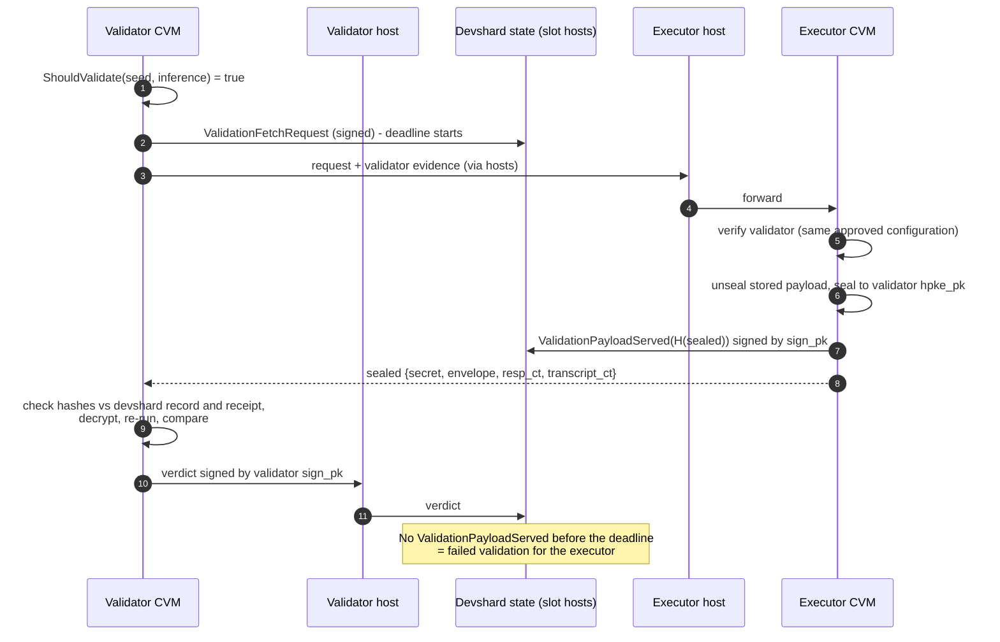

Properties:
- The host cannot hide which requests are validated, because it does not know them in advance, and withholding a requested payload fails the validation.
- A forged executor cannot skip validation, because it does not choose the sample.
- Plaintext exists only inside two attested CVMs.
- After a CVM restart the sealed payloads are lost with the storage key. Requests from the previous boot then fail validation unless they are excluded from the window. This interacts with the restart policy in [§6.1.1](#611-restart-policy-wait-for-the-next-epoch).
- **Known gap:** without a light client, the executor checks the validator only against values built into its image, so it cannot see revocations issued after the image was built ([§6.10](#610-under-discussion-light-client-inside-cvms)).

### 6.9 Gateway trust boundary

Escrow creation is allowlisted on mainnet (`allowed_creator_addresses`, 18 addresses as of epoch 403). The party that runs `devshardctl`, and therefore performs the encryption in [§6.6](#66-executor-selection-and-key-discovery), is in practice a gateway operator, not the end user. The design supports two modes:

| Mode | Where plaintext exists | Guarantee to the end user | Cost |
|---|---|---|---|
| **Plain gateway** (default, first release) | User app → gateway (TLS) → **gateway process** → MLNode CVM | Confidential **from hosts**, not from the gateway operator | No change to gateways |
| **TEE gateway** (target) | Only inside the gateway CVM and the MLNode CVM | End-to-end: neither the gateway operator nor hosts see plaintext | Gateway runs in a CPU-only CVM with an attested release |

The plain gateway is an honest intermediate state. It matches today's trust model, where users already trust their gateway, and removes the hosts from it. The API should say which mode a request ran in so that users are not misled.

#### 6.9.1 TEE gateway

The gateway (`devshardctl`) runs in a CPU-only confidential VM built with the same pipeline as the MLNode:

- dstack guest, `key_provider = none`, per-boot `gw_hpke` and `gw_sign` keys.
- Its image, compose and measurements are pinned as a separate release kind in the registry (`TeeRelease.kind = gateway`), approved by governance.
- The expected measurements of the MLNode releases it serves are built into its image as paired releases ([§6.4.1](#641-where-verification-runs)). It does not take them from its host.
- It attests with a **gateway evidence profile**, selected by the release kind:
  - CPU-only `GatewayShape`s ([§6.2](#62-release-registry-on-chain-version-pinning)) and no GPU evidence;
  - its machine is registered to the operator's allowlisted creator address;
  - two `report_data` layouts: the per-epoch one from [§6.3](#63-attestation-binding-report_data) without the GPU term, for chain records; and an interactive one for users, `SHA256("gonka/cmln/gw-report-data/v1" ‖ client_nonce ‖ SHA256(gw_hpke ‖ gw_sign))`, answering `/attest?nonce=` from the user SDK.
- **Wallet key.** The operator passes the key of its allowlisted creator address into the CVM as a boot-time secret. `devshardctl` inside the CVM uses it to sign `MsgCreateDevshardEscrow` and every session diff: devshard requires diffs to be signed by the escrow creator (`UserSig` is checked against the creator address, `devshard/state/machine.go`). No change to the allowlist or to devshard.
  - The operator also holds this key. That is acceptable: the escrow creator is trusted for funds and escrows ([§3](#3-threat-model)), and the key gives no access to plaintext. Users encrypt to the separate per-boot `gw_hpke` key, which never leaves the CVM.
  - The only thing the operator must not learn from signing is prompt content. Diffs carry `H(request envelope)`, not a plaintext hash ([§6.6.3](#663-envelope)).
- It can parse the body inside the CVM, because it needs `model`, `max_tokens` and similar fields for cost reservation. Nothing it logs or sends outside the CVM may contain body content.

The user encrypts to the gateway's key with the same envelope (one recipient). The gateway decrypts inside its CVM and re-encrypts to the K MLNode keys:

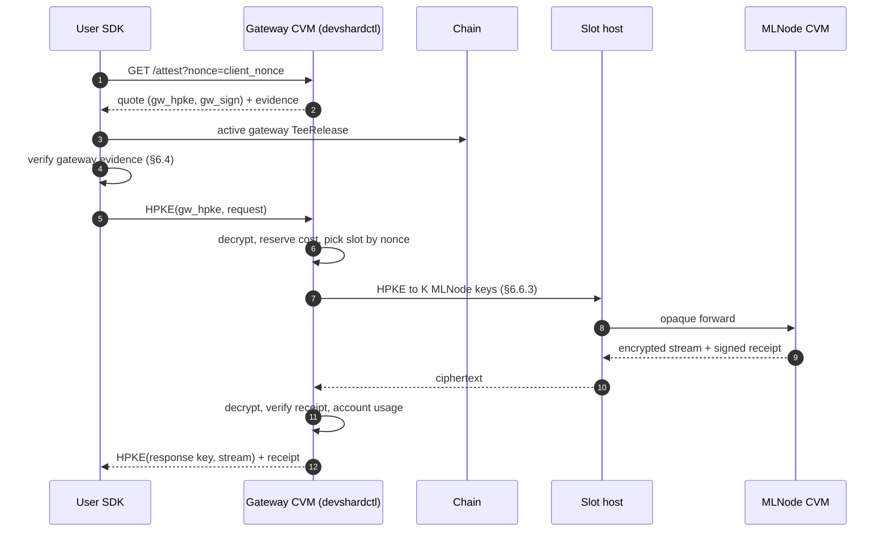

#### 6.9.2 Path from plain to TEE gateway

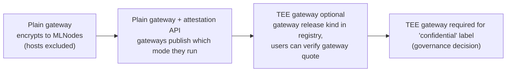

- Nothing in the MLNode path changes between the plain and the TEE gateway. The MLNode only sees an envelope from whoever holds the escrow.
- An alternative to a TEE gateway is letting end users create escrows themselves and run `devshardctl` locally. This needs changes to the creator allowlist and is out of scope here.

### 6.10 Under discussion: light client inside CVMs

This section is a proposal. Once agreed, it closes the known gaps in [§6.4.1](#641-where-verification-runs), [§6.4.2](#642-collateral-freshness) and [§6.8](#68-validation-pull-driven-by-validators).

**Problem.** A CVM that is about to send plaintext to another CVM (executor → validator; TEE gateway → MLNodes) checks the peer only against values built into its image. It cannot learn from its host, in an authenticated way, that the peer's machine was deny-listed, that its attestation was revoked, that the release expired, or which epoch it is. A host can therefore steer plaintext to a peer that the chain has already revoked, for example a machine whose attestation key leaked.

**Proposal.** Each CVM image contains a minimal CometBFT light client:
- a trusted checkpoint (height, validator set hash) is built into the image and refreshed with each release;
- the host relays headers and commits; the CVM verifies validator signatures and validator-set transitions itself;
- before sending plaintext to a peer, the CVM requests IAVL state proofs, relayed by the host, for:
  - the peer's `TeeAttestation` record in the current epoch (status `VERIFIED`, keys, `machine_id`);
  - `denied_machine_ids` and the collateral floors;
  - the active `TeeRelease` (not expired);
- a verified header proves that a block existed, **not how old it is now**: the host can replay old headers and freeze the guest's view of time. Freshness therefore comes from a **nonce anchored in the chain**:
  1. the CVM generates a random nonce and **starts its secure-TSC timer at that moment** (a timestamp counter the host cannot change);
  2. the host must include the nonce in a transaction (`MsgTeeHeartbeat`, one per CVM per `cvm_heartbeat_interval`);
  3. the CVM verifies, through the light client, that the nonce is in block `h`. The chain state at `h` is therefore newer than the nonce;
  4. the whole round trip (nonce generation → inclusion → proof delivered to the CVM) must fit in `cvm_max_anchor_delay` of secure-TSC time. If it does not, the anchor is discarded: a host that withholds the proof cannot make an old state look fresh;
  5. the age of the state is measured from nonce generation, not from proof delivery.
- the anchored header gives the CVM an authenticated time and epoch, so collateral windows can be checked inside the CVM too.

The host can still withhold new headers (liveness), but it cannot present an old state as current beyond a freshness limit: the CVM refuses to send plaintext (fails closed) if the time since the nonce of its latest valid anchor exceeds `cvm_max_header_age` by secure-TSC time.

**Checkpoint validity.** A CometBFT light client can only follow the chain from a checkpoint within its trusting period (bounded by the unbonding period). If the checkpoint built into the image is older than that, the CVM cannot verify anything and refuses to send plaintext. Releases must therefore be refreshed more often than the trusting period, and each release carries a checkpoint and its expiry.

Open points: implementation size in the MLNode image; confirm secure TSC on TDX and on SNP (SecureTSC is available only on newer EPYC generations); values of `cvm_heartbeat_interval`, `cvm_max_anchor_delay` and `cvm_max_header_age`; behavior of the secure TSC across VM suspend; state added by heartbeats.

## 7. AMD SEV-SNP support

dstack guest OS ≥ 0.6.0 uses one image for both TDX and SNP. SNP support in dstack is marked **experimental** (`docs/amd-sev-snp.md`).

Differences that matter:

| Topic | Impact on this design |
|---|---|
| No runtime measurement register (no RTMR3) | App identity comes from `HOST_DATA` → MrConfigV3. `HOST_DATA` is supplied by the host and only authenticated by the report; it means "application identity" only because the approved guest image checks that its running configuration matches it (compose-hash, gpu_policy_hash). dstack's boot-time `gpu-attestation` event is **not bound** on SNP, hence GPU evidence goes into `report_data` ([§6.3](#63-attestation-binding-report_data)). |
| Single launch `MEASUREMENT` | One expected value per shape (vCPU count/type, OVMF, kernel, initrd, cmdline), computed with `sev-snp-measure` / dstack tooling. |
| VCEK per chip and TCB, from AMD KDS (rate-limited) | Node embeds the VCEK chain in the evidence (extended report); verifiers pin ARK per product family. |
| `MaskChipId` platform setting (`SNP_CONFIG`, not guest policy) | If set, `CHIP_ID` in reports is zero and the machine registry cannot work. Verifiers reject a zero `CHIP_ID` and bind it to the VCEK certificate's hardware ID. |
| VLEK (cloud-provider signing key) | Rejected. Only VCEK is allowed for self-hosted machines. |
| Hypervisor ciphertext side channels (deterministic memory encryption) | The host controls the hypervisor. Set the SNP firmware/TCB floor to include vendor mitigations and review AMD bulletins per release. |
| DDR4 platforms (Milan) | Exposed to cheap interposers (Battering RAM). Consider Genoa/Turin only. |

Platform priority: the platform abstraction and evidence format cover both platforms from the start; TDX is supported first, and the SNP verifier and shapes are added once Genoa/Turin + H100/H200 hardware is available for testing.

## 8. Chain changes (summary)

| Component | Change |
|---|---|
| Params | `TeeReleases[]` (kinds `mlnode` and `gateway`, each with `HostStack` and per-GPU vCPU/RAM), `VmShapes[]` (standardized catalog, [§6.2.1](#621-shape-catalog)), `TdxPolicy`, `SnpPolicy`, `NvidiaPolicy` (incl. collateral floors: `min_tcb_evaluation_data_number`, `min_pck_crl_number`, `min_amd_crl_number`, SNP SVN floors, driver/RIM floors), `max_collateral_age`, `denied_machine_ids`, pinned roots (Intel SGX root, AMD ARKs, NVIDIA root), `validation_threshold_bps` (attestation votes), `confidential_recipients_k` (default 3), `confidential_max_slots_per_participant` (default 5), `confidential_min_participants` (default 4), `tee_committee_size` (default 0 = all), `tee_evidence_retention_epochs` (off-chain, default 3), `tee_max_challenges_per_epoch`, `tee_machine_denial_epochs`, `tee_machine_rebind_cooldown_epochs`, `attested_capacity` (per model × GPU model × GPU count), `cmln_nonce_window` (default 4096), `validation_fetch_deadline`, `tee_challenge_vote_blocks`; if the light client is adopted: `cvm_heartbeat_interval`, `cvm_max_anchor_delay`, `cvm_max_header_age`. |
| Messages | `MsgRegisterTeeMachine`, `MsgUnregisterTeeMachine`, `MsgSubmitTeeAttestation` (commitment only), `MsgSubmitTeeValidations` (votes carry a reason code), `MsgChallengeTeeAttestation` (with `collateral_hash`; the chain records `H_c`), `MsgSubmitTeeChallengeVotes`, `MsgTeeHeartbeat` (only if the light client is adopted, [§6.10](#610-under-discussion-light-client-inside-cvms)). Confidential validation verdicts go through devshard state, not new chain messages ([§6.8](#68-validation-pull-driven-by-validators)). |
| State | Per-epoch attestation **commitments** only (~250 B each, [§6.3.1](#631-what-goes-on-chain-commitment-only)): no quotes, collateral or GPU evidence; vote tallies plus a voter bitmap per voting round (deleted at settlement) instead of individual votes. Kept for epochs `E` and `E+1`, then pruned (records in `CHALLENGED` until resolved). Also: the machine registry; a revoked-key set (keys of `REVOKED` records, never re-registrable); time-limited entries in `denied_machine_ids`; a per-machine collateral floor after an upheld revocation; open challenge records (`H_c`, `collateral_hash`, deadline) and per-participant challenge counters; heartbeat nonces for the current window (light client only); `gpu_device_id → attestation` for the current epoch. |
| Settlement | No carry-forward. `VERIFIED` is valid for epoch `E` only. |
| Escrow | `MsgCreateDevshardEscrow` gets a `confidential` flag: slots sampled only among participants with `VERIFIED` nodes for the model, by confidential weight, with a per-participant slot cap. |
| devshard | Encrypted route goes through the normal state machine: nonce, receipts (`UsageReceipt`), cost accounting, validation sampling. Broker accepts a list of allowed recipient key IDs. New devshard state entries: `ValidationFetchRequest` and `ValidationPayloadServed` ([§6.8](#68-validation-pull-driven-by-validators)); slot hosts check receipts before co-signing ([§6.7](#67-usage-receipts)). |
| Economics | Not designed here; see [§10](#10-economics-todo). |

## 9. Open questions

1. **Validation payload size.** Long-context requests re-encrypted to validators increase bandwidth; devshard's existing `validation_rate` and payload caps need tuning for confidential escrows.
2. **Challenge limit.** Value of `tee_max_challenges_per_epoch` per participant.
3. **Receipts signed by a `REVOKED` key.** The chain sees only per-slot `host_stats` at devshard settlement, not individual receipts. How should devshard treat receipts signed by a key revoked before settlement?
4. **Collateral validity periods.** Confirm the actual validity windows of Intel TCB Info, QE Identity and CRLs, AMD CRLs and NVIDIA OCSP/RIMs, to choose `max_collateral_age` ([§6.4.2](#642-collateral-freshness)).
5. **Wire protocol specification.** The envelope, response and transcript encryption need a byte-level specification: canonical encodings (including `report_data` fields with length framing), separate key domains for request, response and transcript, chunk counters and nonce derivation, an authenticated final chunk and truncation handling, and the exact bytes each hash covers. It needs cross-language test vectors before cryptographic review.
6. **Managed dstack clouds (for example Phala Cloud).** Any TDX or SEV-SNP machine with NVIDIA CC, rented or cloud included, is eligible if it passes the same verification as a self-hosted one. Check whether such a provider allows that:
    - [ ] Can the VM boot our own OS image (the release's `os_image_hash`), or only the provider's stock dstack images?
    - [ ] Can the app run with `key_provider = none`, or is the provider's KMS mandatory?
    - [ ] Do the provider's VM sizes and host stack (QEMU, OVMF, VMM settings) match a catalog shape and the release `HostStack` ([§6.2.1](#621-shape-catalog))?

    If all three hold, no changes are needed. If not, the fallback is a separate release in the registry built on the stock dstack image and the provider's host stack. It stays reproducible from dstack source, but its shape catalog and host stack would then be the provider's, and we would have to trust them.

7. **Light client inside CVMs** ([§6.10](#610-under-discussion-light-client-inside-cvms)): accept as a required component? Size, checkpoint refresh, secure TSC, `cvm_max_anchor_delay`, `cvm_max_header_age`.
8. **Pull validation parameters** ([§6.8](#68-validation-pull-driven-by-validators)): `validation_fetch_deadline`, how long hosts serve sealed validation blobs, and whether requests from a previous CVM boot are excluded from the validation window.

## 10. Economics (TODO)

> **TODO.** This draft covers the technical design only. Pricing, rewards and penalties for confidential inference are not designed yet. Items to cover:

- [ ] **Pricing:** a separate pricing group per model for confidential inference (proposed in #951), and how the gateway reserves cost for encrypted requests.
- [ ] **Rewards for confidential capacity:** whether to use a multiplier (#951 Open Question 4) and how to account for CC-mode overhead (reported: TTFT +22–28% and throughput −11…−21% on H100; about 1–3% on tuned 8×B200, much more on stock configurations).
- [ ] **Consequences of `REJECTED` / `REVOKED` attestations** ([§6.3.2](#632-retention-and-challenge)): loss of confidential weight or rewards for the epoch, effect on SPRT status (`Invalid++`).
- [ ] **Challenge economics:** a deposit for `MsgChallengeTeeAttestation`, what happens to it, and whether a successful challenger is rewarded.
- [ ] **Validators voting OK on an invalid bundle:** accounting, reputation, penalties.
- [ ] **Hosts that drop confidential validation payloads** ([§6.8](#68-validation-pull-driven-by-validators)).
- [ ] **Receipts signed by a key revoked before settlement:** refunds to the escrow ([§9](#9-open-questions), question 3).
- [ ] **Deterrence against physical attacks** ([§3](#3-threat-model)): stake at risk, slashing for proven forged evidence, or for a `machine_id` found in a forgery incident.
- [ ] **Unplanned restarts** ([§6.1.1](#611-restart-policy-wait-for-the-next-epoch)): whether slots of a host with no live verified node count as missed.

## 11. References

- Attestation glossary with vendor specification sources: [attestation-glossary.md](./attestation-glossary.md)

- Gonka: discussion [#951](https://github.com/gonka-ai/gonka/discussions/951), issue [#1173](https://github.com/gonka-ai/gonka/issues/1173), PR [#1246](https://github.com/gonka-ai/gonka/pull/1246)
- dstack: [repo](https://github.com/Dstack-TEE/dstack) (`docs/attestation-tdx.md`, `docs/amd-sev-snp.md`, `docs/verity-volumes.md`, `docs/security/security-model.md`, `dstack-mr`), [paper](https://arxiv.org/abs/2509.11555), issues [#1287](https://github.com/Dstack-TEE/dstack/issues/1287) / [#1288](https://github.com/Dstack-TEE/dstack/issues/1288) / [#1293](https://github.com/Dstack-TEE/dstack/issues/1293)
- Verifiers: [google/go-tdx-guest](https://github.com/google/go-tdx-guest), [google/go-sev-guest](https://github.com/google/go-sev-guest), [NVIDIA attestation](https://docs.nvidia.com/attestation/)
- Hardware/host: [canonical/tdx](https://github.com/canonical/tdx), [NVIDIA nvtrust](https://github.com/NVIDIA/nvtrust) (issue #153: NVSwitch attestation in TDX guest)
- Physical attacks: [TEE.fail](https://tee.fail), [Battering RAM](https://batteringram.eu), [Proof of Cloud](https://writings.flashbots.net/mind-the-gap-tee-poc)
- Hypervisor-level attacks: [Heracles](https://heracles-attack.github.io/) (SEV-SNP ciphertext side channel)
