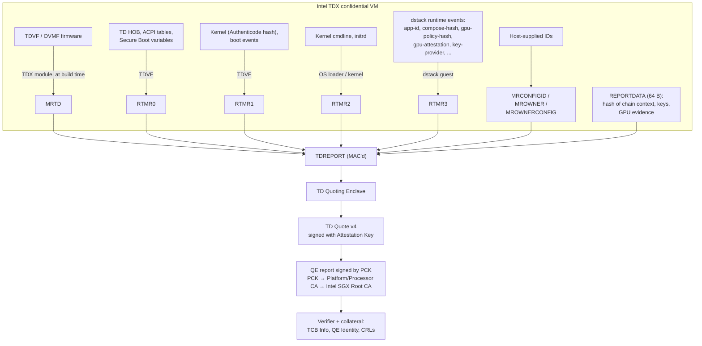
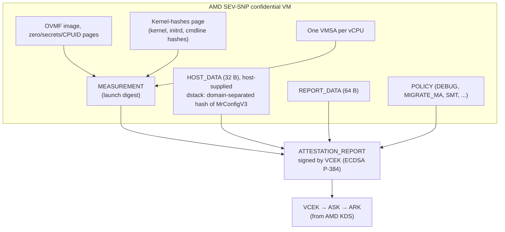

# Attestation glossary: Intel TDX, AMD SEV-SNP, NVIDIA GPU CC, dstack

Companion to [Confidential MLNode](./README.md). This page explains the measurement registers, report fields and collateral used in the design: what each one is, what it is made of, and what it attests.

Checked against vendor specifications and the dstack source on 2026-09-24. Items that could not be verified are marked **(unverified)**. Source keys are listed in [§6](#6-sources).

## 1. How the pieces fit

## 2. Intel TDX

### 2.1 Measurement registers

All are SHA-384 (48 bytes). RTMR extension is `RTMR := SHA384(RTMR ‖ 48-byte digest)` (confirmed from the Intel TDX module implementation and dstack-mr).

| Register | Extended by | Contains | What it attests | TCG PCR equivalent / CC MR index | Source |
|---|---|---|---|---|---|
| **MRTD** | TDX module, at the host VMM's request, before `TDH.MR.FINALIZE` (`TDH.MEM.PAGE.ADD`, `TDH.MR.EXTEND`) | The TD's initial memory contents; in practice the TDVF/OVMF firmware code | Which virtual firmware the VM booted | PCR[0] / 0 | I-ABI §5.4.22.3.4, §5.4.47; I-TDVF Table 8-1 |
| **RTMR0** | TDVF | Firmware configuration: CFV, TD HOB, ACPI tables, Secure Boot variables (PK, KEK, db, dbx), boot variables | VM hardware configuration; depends on vCPU count, RAM size and devices (the "shape") | PCR[1], PCR[7] / 1 | I-TDVF; D `dstack-mr/src/tdvf.rs` |
| **RTMR1** | TDVF | Components TDVF loads: OS loader, kernel (Authenticode SHA-384), boot events ("Calling EFI Application…", separator, ExitBootServices) | Which kernel was booted | PCR[2–5] / 2 | I-TDVF; D `dstack-mr/src/kernel.rs` |
| **RTMR2** | OS loader / kernel | Kernel cmdline (UTF-16LE hash) and initrd; the cmdline carries the rootfs dm-verity root | Which initrd, cmdline and root filesystem were booted | PCR[8–15] / 3 | I-TDVF; D `dstack-mr/src/machine.rs` |
| **RTMR3** | Guest software at runtime (TDVF spec: "reserved for special usage") | In dstack: application launch events (§5) | Which application, compose file, GPU policy and key provider the VM runs | — / 4 | I-TDVF; D |

### 2.2 Other quote fields

| Field | What it is | Size | Source |
|---|---|---|---|
| **MRSEAM** | Measurement of the TDX module (SEAM) that created the TD | 48 | I-ABI Table 3.43; I-QV |
| **MRSIGNERSEAM** | Signer of the TDX module; all zeros for Intel's module in the documented module versions | 48 | I-ABI; I-QV |
| **SEAMATTRIBUTES** | TDX module attributes; all zeros | 8 | I-ABI; I-QV |
| **TEE_TCB_SVN** | Security version of the TDX module (byte 0 minor SVN, byte 1 major SVN, byte 2 `SEAM_LAST_PATCH_SVN` of the loaded module). Compared with TCB Info `tdxtcbcomponents`. `TEE_TCB_SVN_2` is the *current* module after a TD-preserving update | 16 | I-ABI §3.9.4; I-QV A.3.3 |
| **TD_ATTRIBUTES** | TD properties. Bit 0 **DEBUG**: the host can read the TD's CPU state and private memory. Any bit in bits 7:0 makes the TD untrusted. Bit 28 SEPT_VE_DISABLE, 30 PKS, 31 KL, 63 PERFMON | 8 | I-QV A.3.4 |
| **XFAM** | Extended CPU features enabled for the TD (XCR0/IA32_XSS format) | 8 | I-QV |
| **MRCONFIGID** | Opaque ID supplied by the host at TD init, part of the measured configuration. dstack puts `0x03 ‖ H(MrConfigV3)` here | 48 | I-ABI Table 3.22; D `mr_config.rs` |
| **MROWNER / MROWNERCONFIG** | Opaque IDs supplied by the host: the TD owner and owner/workload configuration | 48 each | I-ABI Table 3.22 |
| **REPORTDATA** | 64 bytes chosen by the software in the TD, covered by the quote signature. The Confidential MLNode puts the hash of nonce, keys and GPU evidence here | 64 | I-QV; I-ABI Table 3.44 |

### 2.3 Reports, quotes and keys

| Term | What it is | Source |
|---|---|---|
| **TDREPORT** | Output of `TDG.MR.REPORT`: REPORTMACSTRUCT + TEE_TCB_INFO + TDINFO (1024 B, or 1280 B for REPORTTYPE.VERSION 2). **MAC'd, not signed**: only the Quoting Enclave on the same platform can check it | I-ABI §3.9.2–3.9.7; K-TDX |
| **TD Quote v4** | What leaves the machine: header (48 B, version 4, key type ECDSA P-256, TEE type 0x81) + TD quote body (584 B, the fields above) + signature data (ECDSA signature over header and body, Attestation Key, QE certification data) | I-QV App. A.3 |
| **Quote v5** | Adds a body descriptor; body type 3/4 (TDX 1.5) adds `TEE_TCB_SVN_2` and `MRSERVICETD` | I-QV A.4 |
| **QE (TD Quoting Enclave)** | Intel-signed SGX enclave that turns a TDREPORT into a signed quote. It holds the ECDSA P-256 **Attestation Key**; its own **QE report** binds that key and is signed by the PCK | I-QV §1.1, §2.1 |
| **QGS** | Host daemon that runs the PCE and the TD Quoting Enclave | I-QV |
| **PCK** | Provisioning Certification Key: unique per platform and TCB level. Chain: PCK leaf → Intel SGX PCK Platform CA or Processor CA → **Intel SGX Root CA** (all ECDSA P-256). The leaf carries PPID, TCB components, PCE-ID, FMSPC | I-PCK §1.3; I-QV |
| **PPID** | Platform Provisioning ID: unique per platform, independent of TCB. The Confidential MLNode's machine registry uses it | I-PCK; I-PCS |
| **FMSPC** | Family-Model-Stepping-Platform-CustomSKU (6 B): the platform model, used to fetch TCB Info | I-PCK; I-PCS |

### 2.4 Collateral

| Term | What it is | Source |
|---|---|---|
| **TCB Info** | Signed JSON from Intel for one FMSPC: `issueDate`, `nextUpdate`, `tcbEvaluationDataNumber`, TDX module identities, and TCB levels mapping SVNs to a status | I-PCS (`/tdx/certification/v4/tcb`) |
| **TCB status** | `UpToDate`, `SWHardeningNeeded`, `ConfigurationNeeded`, `ConfigurationAndSWHardeningNeeded`, `OutOfDate`, `OutOfDateConfigurationNeeded`, `Revoked`. The verification library also reports `TD_RELAUNCH_ADVISED` when a TD started before a TD-preserving module update | I-PCS; I-QV §3 |
| **tcbEvaluationDataNumber** | Counter that increases with every TCB Recovery event | I-PCS |
| **TCB Recovery** | Intel's process after a security advisory: new TCB levels are published, and platforms without the fix drop to `OutOfDate` | I-PCS |
| **QE Identity** | Signed description of the valid Quoting Enclave (mrsigner, attributes, ISV SVN → status) | I-PCS (`/tdx/certification/v4/qe/identity`) |
| **PCK CRL / Root CA CRL** | Revoked PCK and intermediate certificates | I-PCS; I-PCK §1.4 |
| **PCS / PCCS** | PCS: Intel's online service for certificates and collateral. PCCS: a local cache of the same data | I-QV §2.1; I-PCCS |
| **configfs-tsm** | Linux interface for getting a report or quote from inside the guest: `/sys/kernel/config/tsm/report/*` (`inblob` ≤ 64 B, `outblob`, `provider` = `tdx_guest` or `sev_guest`) | K-TSM |

## 3. AMD SEV-SNP

SNP has **one** launch measurement and **no runtime measurement register**. Application identity therefore goes into `HOST_DATA`, and anything that happens after launch (for example GPU evidence) must be bound through `REPORT_DATA`.

### 3.1 ATTESTATION_REPORT fields (report version 5, ABI Rev 1.58)

| Field | What it is | Size (offset) | Source |
|---|---|---|---|
| **MEASUREMENT** | Launch digest. Every `SNP_LAUNCH_UPDATE` extends it with page information whose content part depends on the page type (normal pages contribute their contents; zero, secrets and CPUID pages are handled specially). It covers the OVMF image, special pages (zero, secrets, CPUID), the **kernel-hashes page** and **one VMSA per vCPU**. It therefore depends on firmware, kernel, initrd, cmdline, vCPU count and vCPU type | 48 (90h) | A-SNP §8.17 Table 70; D `dstack-mr/src/sev.rs` |
| **HOST_DATA** | Value supplied by the **host** (hypervisor) at `SNP_LAUNCH_FINISH`. The report only authenticates that this value was set at launch; the hardware does not measure the application into it. dstack puts `H(MrConfigV3)` here (app identity, compose-hash, GPU policy hash, key provider); that meaning holds only because the approved guest image checks at boot that its running configuration matches the document behind `HOST_DATA` | 32 (C0h) | A-SNP Table 23; D `mr_config.rs` |
| **REPORT_DATA** | 64 bytes from the guest, covered by the signature; zero if the host requested the report | 64 (50h) | A-SNP Table 23 |
| **POLICY** | Guest policy fixed at launch. Bit 16 SMT, bit 17 reserved (must be 1), bit 18 **MIGRATE_MA**, bit 19 **DEBUG**, bit 20 SINGLE_SOCKET, bit 22 MEM_AES_256_XTS, bit 24 CIPHERTEXT_HIDING_DRAM, bit 25 PAGE_SWAP_DISABLE | 8 (08h) | A-SNP Table 9; QEMU |
| **VMPL** | VMPL selected for the report (0–3; 0xFFFFFFFF if the host requested it). By itself it does not prove the privilege level the caller runs at | 4 (30h) | A-SNP Table 23 |
| **CURRENT / REPORTED / COMMITTED / LAUNCH_TCB** | Firmware TCB versions: installed; reported by the hypervisor (used to derive the VCEK); anti-rollback floor; version at guest launch. Components: boot loader, TEE, SNP, microcode (Turin adds FMC). Requiring them to be equal is this design's policy, not an ABI requirement | 8 each | A-SNP §2.2, Tables 3/4, 23 |
| **PLATFORM_INFO** | Platform state: SMT enabled, TSME enabled, ECC, RAPL disabled, ciphertext hiding, alias check complete, TIO | 8 (40h) | A-SNP Table 24 |
| Flags (48h) | AUTHOR_KEY_EN, MASK_CHIP_KEY, SIGNING_KEY (0 = VCEK, 1 = VLEK, 7 = none) | 4 (48h) | A-SNP Table 23 |
| **CHIP_ID** | Unique chip identifier; zero if the platform sets MaskChipId. The machine registry uses it | 64 (1A0h) | A-SNP Table 23 |
| GUEST_SVN, FAMILY_ID, IMAGE_ID | Guest SVN and owner-defined IDs from the optional ID block | 4 / 16 / 16 | A-SNP Tables 23, 75 |
| ID_KEY_DIGEST, AUTHOR_KEY_DIGEST | Hashes of the keys that signed the ID block | 48 / 48 | A-SNP Table 23 |
| REPORT_ID, REPORT_ID_MA | ID of this guest and of its migration agent | 32 / 32 | A-SNP Table 23 |
| SIGNATURE | ECDSA P-384 over bytes 0h–29Fh (report size 1184 B) | 512 (2A0h) | A-SNP Table 23, ch. 10 |

### 3.2 Keys and collateral

| Term | What it is | Source |
|---|---|---|
| **VCEK** | Versioned Chip Endorsement Key (ECDSA P-384), derived from chip-unique secrets and the reported TCB. Its certificate carries the TCB component SPLs and hwID | A-SNP §2.3; A-KDS |
| **ASK / ARK** | AMD SEV Signing Key and AMD Root Key (RSA-4096), one pair per product family (Milan, Genoa, Turin). Chain: VCEK → ASK → ARK | A-KDS |
| **VLEK** | Versioned Loaded Endorsement Key: alternative to the VCEK, derived from a seed that AMD provisions for an enrolled cloud provider. Chain ARK → ASVK → VLEK (AMD KDS VLEK chain endpoint; go-sev-guest) | A-SNP §3.7 |
| **KDS** | AMD Key Distribution Service: VCEK certificates, ARK/ASK chain and CRL (`kdsintf.amd.com/vcek/v1/...`) | A-KDS §4 |
| **MaskChipId / MaskChipKey** | **Platform** settings (`SNP_CONFIG`), not guest policy: zero CHIP_ID in reports; leave reports unsigned. A verifier that relies on CHIP_ID must reject zero values and match CHIP_ID to the hardware ID in the VCEK certificate | A-SNP §3.6, Tables 23, 47 |
| **Kernel hashes (measured direct boot)** | With `kernel-hashes=on`, QEMU writes the kernel, initrd and cmdline hashes into an OVMF page that is measured into MEASUREMENT; OVMF checks the loaded files against it | QEMU; D `sev.rs` |

## 4. NVIDIA GPU confidential computing

| Term | What it is | Source |
|---|---|---|
| **GPU attestation report** | DMTF SPDM 1.1 MEASUREMENT response signed by the GPU: runtime measurements plus the requester's 32-byte nonce (NVAT SDK `spdm_req.hpp`). Evidence = report + certificate chain + GPU info. A universal mapping of measurement indices across GPU families is **(unverified)** | N-LV; N-EV |
| **Device identity certificate chain** | GPU certificates up to the NVIDIA root, each checked with OCSP. The underlying fused key hierarchy **(unverified)** | N-CL; N-SDK |
| **RIM** | Reference Integrity Manifest: NVIDIA-signed "golden measurements" for the driver and the VBIOS (TCG RIM, SWID-tag schema), served by the RIM service | N-LV; N-RIM |
| **OCSP** | NVIDIA's certificate revocation status service | N-NRAS |
| **NRAS / local verifier** | NRAS: NVIDIA's online verifier, returns signed EAT tokens. Local verifier: checks chain, OCSP, RIM and measurements on the machine; it runs offline only if all collateral (RIMs, OCSP responses) is supplied and live retrieval is disabled. `nvattest` (NVAT SDK) supports both (`--verifier local|remote`) and Rego policies | N-NRAS; N-LV; N-SDK; N-CL |
| **CC mode** | GPU mode set from the host (`--set-cc-mode on|off|devtools`); queried with `nvidia-smi conf-compute` | N-DG |
| **PPCIe** | Protected PCIe: Hopper multi-GPU mode with GPUs and NVSwitches in one CVM. GPU-to-GPU NVLink traffic is not encrypted | N-DG |
| **MPT CC** | Blackwell multi-GPU passthrough: up to 8 GPUs per CVM with encrypted NVLink (driver R595) | N-RN |
| **GPU ready state** | The GPU accepts no work until the ready state is set, normally after successful attestation | N-DG; N-RN |

## 5. dstack

| Term | What it is | Source |
|---|---|---|
| **Runtime events** | Events extended into **RTMR3** on TDX. Event type `0x08000001`. Digest v1: `SHA384(type_le_u32 ‖ ":" ‖ name ‖ ":" ‖ raw payload bytes)`; v2: `SHA384(JCS{name, type (number), payload (hex)})`. Logged to `/run/log/dstack/runtime_events.log` after the extend | D `cc-eventlog/src/runtime_events.rs` |
| **Event order** | Boot: `system-preparing` → `app-id` → `compose-hash` → `init-script-hash`* → `gpu-policy-hash` → `gpu-attestation` (GPU only) → `instance-id` → `boot-mr-done`. Then, conditionally: `os-image-hash` (**KMS path only**, emitted during key acquisition), `key-provider`, `storage-fs`, `storage-encrypted` (encrypted disk only), and `system-ready` last. With `key_provider = none` there is no `os-image-hash` event | D `dstack-util/src/system_setup.rs` |
| **compose-hash** | SHA-256 of the raw bytes of `app-compose.json`. Pins container images (by digest), verity volumes (model weights) and the GPU policy | D `system_setup.rs` |
| **app-id** | 20 bytes; defaults to the first 20 bytes of compose-hash, but the deployer can set it | D `system_setup.rs` |
| **instance-id** | `SHA-256(seed ‖ app_id …)[..20]`; random per boot without a KMS | D `system_setup.rs` |
| **gpu-policy-hash / gpu-attestation** | `SHA-256(JCS(gpu_policy))`; the attestation event carries devices, CC mode, debug/secure-boot status and `evidence_sha256` of the full `nvattest` output | D `docs/security/security-model.md` |
| **key-provider** | Which key provider the VM uses, as JSON `{name, id}`. Configuration values are `none`, `kms`, `local`, `tpm`; the emitted event name for `local` is `local-sgx` | D `system_setup.rs` |
| **os_image_hash** | `SHA-256(sha256sum.txt)` of the OS image. Bound by recomputing MRTD and RTMR0–2 (or the SNP measurement) from the image and `vm_config` | D `docs/amd-sev-snp.md` |
| **MrConfig V3** | `h = SHA256("dstack-mr-config-v3:" ‖ 0x00 ‖ JCS document)`, where the document holds app_id, compose_hash, gpu_policy_hash, key_provider, instance_id and init script hashes. TDX: `MRCONFIGID = 0x03 ‖ h ‖ padding`. SNP: `HOST_DATA = h` | D `dstack-types/src/mr_config.rs` |
| **vm_config** | Launch shape declared by the host: os_image_hash, cpu_count, memory_size, num_gpus, num_nvswitches, qemu_version, pci_hole64_size, … It is an input to recomputing MRTD/RTMR0 and the SNP measurement, never trusted by itself | D `dstack-types/src/lib.rs` |
| **Event-log replay** | Recompute RTMR3 from the event log and compare it with the quote, then check each event's payload | D `docs/attestation-tdx.md` |
| **dstack-mr** | Tool that computes expected MRTD, RTMR0–2 (and SNP measurement) offline: `dstack-mr measure -c <vcpus> -m <mem> metadata.json` | D `dstack-mr/` |

## 6. Sources

| Key | Document | URL |
|---|---|---|
| I-QV | Intel TDX DCAP Quote Generation / Verification Library API, Rev 0.91 (Sep 2026) | https://download.01.org/intel-sgx/latest/dcap-latest/linux/docs/Intel_TDX_DCAP_Quoting_Library_API.pdf |
| I-ABI | Intel TDX Module ABI Reference Specification 348551-006US (Apr 2025) | https://cdrdv2-public.intel.com/853289/intel-tdx-module-abi-spec-348551006.pdf |
| I-TDVF | Intel TDX Virtual Firmware Design Guide 344991-004US (Dec 2023) | https://cdrdv2-public.intel.com/733585/tdx-virtual-firmware-design-guide-rev-004-20231206.pdf |
| I-PCS | Intel SGX/TDX Provisioning Certification Service API v4 | https://api.portal.trustedservices.intel.com/content/documentation.html |
| I-PCK | Intel SGX PCK Certificate and CRL Profile, Rev 1.5 (Jan 2022) | https://api.trustedservices.intel.com/documents/Intel_SGX_PCK_Certificate_CRL_Spec-1.5.pdf |
| I-PCCS | Intel PCCS | https://github.com/intel/confidential-computing.tee.dcap.pccs |
| K-TDX | Linux kernel: TDX guest | https://docs.kernel.org/arch/x86/tdx.html |
| K-TSM | Linux kernel ABI: configfs-tsm-report | https://www.kernel.org/doc/Documentation/ABI/testing/configfs-tsm-report |
| A-SNP | AMD SEV-SNP Firmware ABI Specification 56860, Rev 1.58 (May 2025) | https://www.amd.com/content/dam/amd/en/documents/developer/56860.pdf |
| A-KDS | AMD VCEK Certificate and KDS Interface Specification 57230 (the old `/system/files/TechDocs/57230.pdf` link redirects; use the current entry on AMD's developer documentation site) | https://www.amd.com/en/developer/sev.html |
| QEMU | QEMU AMD memory encryption documentation | https://www.qemu.org/docs/master/system/i386/amd-memory-encryption.html |
| N-DG | NVIDIA Deployment Guide for Confidential Computing DU-12302-001 v7.1 (Apr 2026) | https://docs.nvidia.com/cc-deployment-guide-tdx.pdf |
| N-RN | NVIDIA Trusted Computing Solutions R595 Release Notes (Apr 2026) | https://docs.nvidia.com/595trd1-trusted-computing-solutions-release-notes.pdf |
| N-LV | NVIDIA local verifier | https://docs.nvidia.com/attestation/attestation-client-tools-sdk/latest/local-verifier/introduction.html |
| N-EV | NVIDIA: collecting evidence | https://docs.nvidia.com/attestation/quick-start-guide/latest/attestation-examples/collecting_evidence.html |
| N-SDK | NVIDIA NVAT SDK CLI (`nvattest`) | https://docs.nvidia.com/attestation/nv-attestation-sdk-cpp/latest/sdk-cli/introduction.html |
| N-CL | NVIDIA attestation claims schema | https://docs.nvidia.com/attestation/nv-attestation-sdk-cpp/latest/sdk-c/claims_schema.html |
| N-NRAS | NVIDIA Remote Attestation Service | https://docs.nvidia.com/attestation/cloud-services/latest/nras/nras_introduction.html |
| N-RIM | NVIDIA RIM service | https://docs.nvidia.com/attestation/cloud-services/latest/rim/rim_introduction.html |
| D | dstack source, commit `9db0b6fb` (2026-09-24) | https://github.com/Dstack-TEE/dstack |